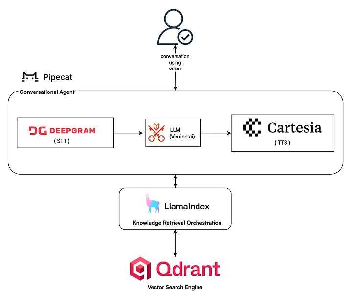

# Pipecat Voice Bot

A real-time voice AI assistant using Pipecat framework with Ollama LLM, Deepgram speech-to-text, and Cartesia text-to-speech.

# Flow diagram (RAG With Voice agent)



## Features

- Real-time voice conversations
- Local LLM using Ollama (Granite 3.2 Vision)
- High-quality speech recognition (Deepgram)
- Natural voice synthesis (Cartesia)
- Smart turn detection for natural conversations (silero)
- Voice Activity Detection (VAD) (silero)

## Prerequisites

- Python 3.8+
- Ollama installed locally with `granite3.2-vision:latest` model
- API keys for:
  - Deepgram (speech-to-text)
  - Cartesia (text-to-speech)

## Installation

1. Clone the repository

2. Install dependencies:
```bash
pip install -r requirements.txt
```

3. Create a `.env` file in the project root:
```env
DEEPGRAM_API_KEY=your_deepgram_api_key
CARTESIA_API_KEY=your_cartesia_api_key
```

## Setup Ollama

1. Install Ollama from [ollama.ai](https://ollama.ai)

2. Pull the Granite model:
```bash
ollama pull granite3.2-vision:latest
```

3. Verify it's running:
```bash
ollama list
```

## Usage

Run the bot:
```bash
python bot.py
```

On first run, it takes about 20 seconds to load models.

## How It Works

1. **Speech Input**: User speaks → Deepgram converts to text
2. **Processing**: Text → Ollama LLM generates response
3. **Speech Output**: Response → Cartesia converts to natural voice
4. **Smart Interruptions**: Bot can be interrupted naturally during conversation

## Configuration

### Change Voice

Edit the `voice_id` in `bot.py`:
```python
tts = CartesiaTTSService(
    voice_id="71a7ad14-091c-4e8e-a314-022ece01c121",  # British Reading Lady
)
```

### Use OpenAI Instead of Ollama

Uncomment in `bot.py`:
```python
from pipecat.services.openai.llm import OpenAILLMService
llm = OpenAILLMService(api_key=os.getenv("OPENAI_API_KEY"))
```

Add to `.env`:
```env
OPENAI_API_KEY=your_openai_api_key
```

### Adjust VAD Sensitivity

Modify `stop_secs` parameter:
```python
vad_analyzer=SileroVADAnalyzer(params=VADParams(stop_secs=0.2))
```

Lower values = more sensitive to pauses

## Troubleshooting

**Models loading slowly**: First run downloads models, subsequent runs are faster

**Connection issues**: Check if Ollama is running: `ollama serve`

**Audio not working**: Verify microphone permissions in your browser/system

**API errors**: Verify API keys in `.env` file

## Project Structure

```
.
├── bot.py              # Main bot logic
├── requirements.txt    # Python dependencies
├── .env               # API keys (create this)
└── README.md          # This file
```

## License

APache 2.0