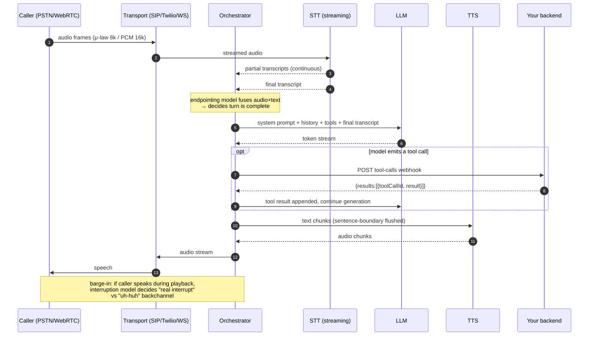
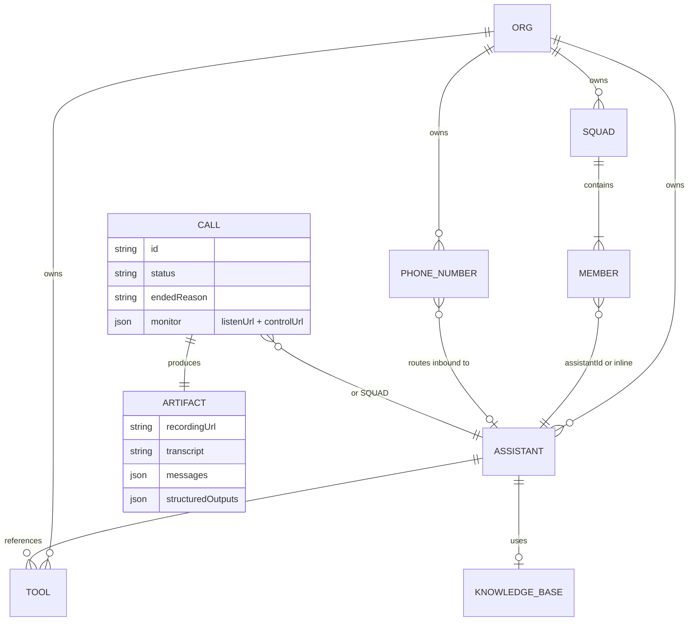
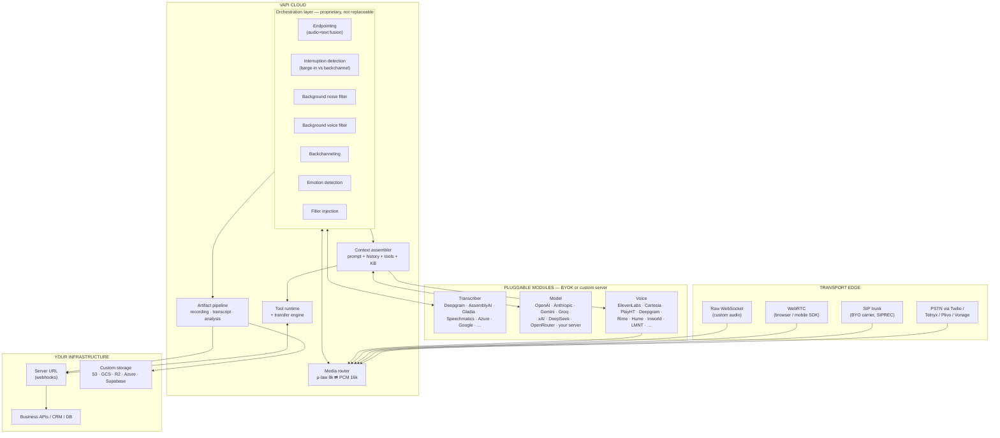
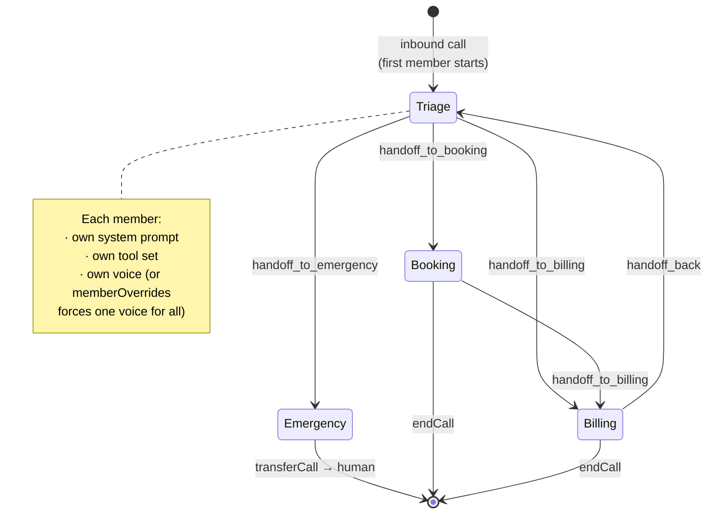
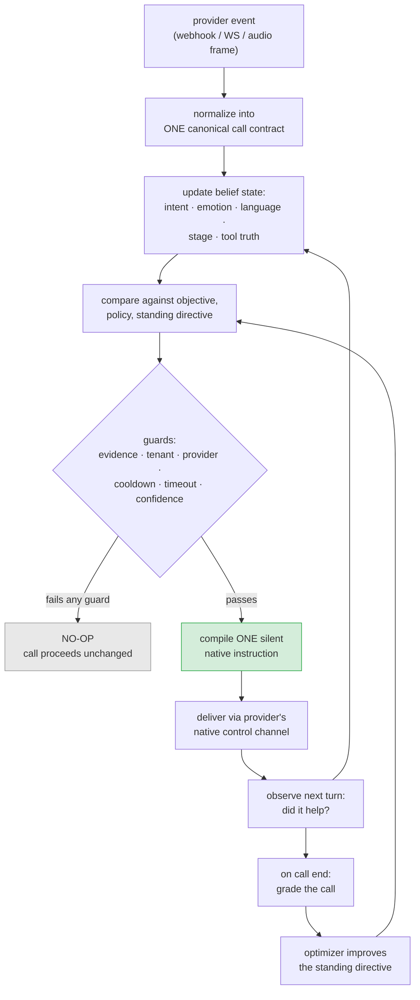
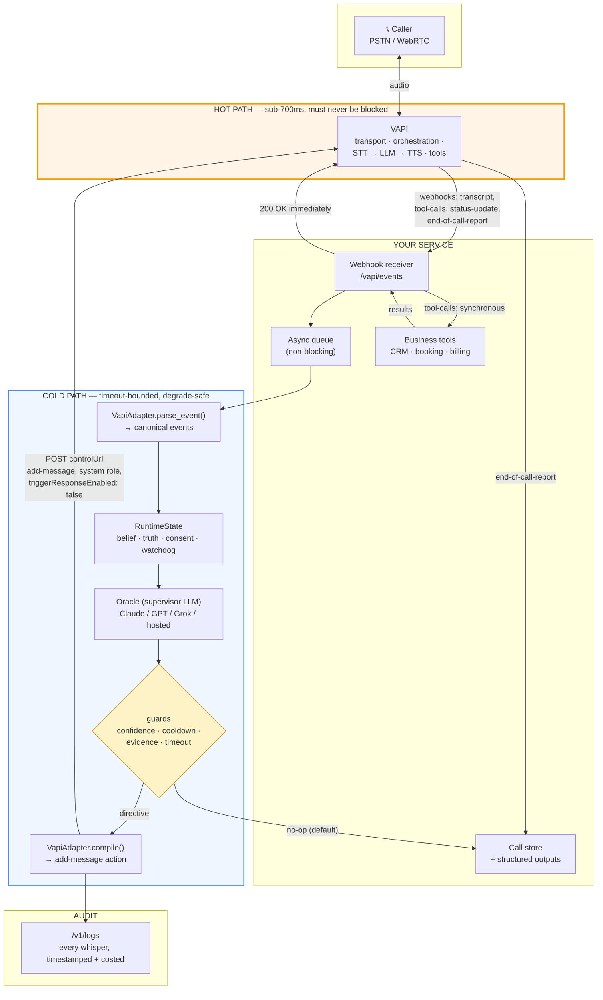
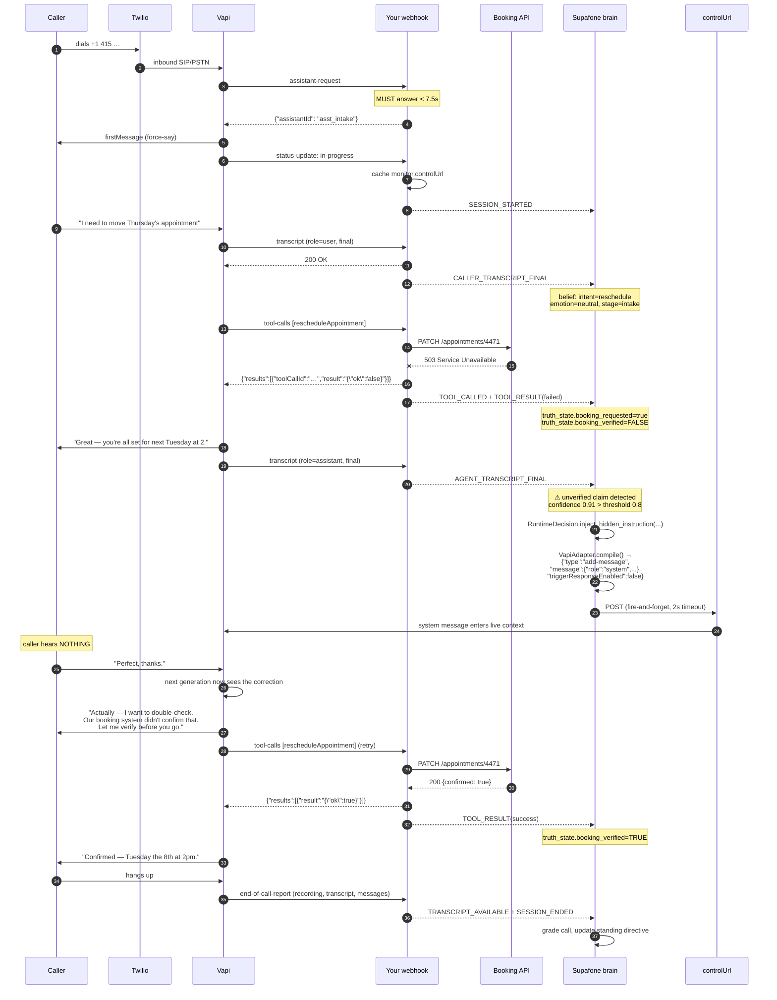
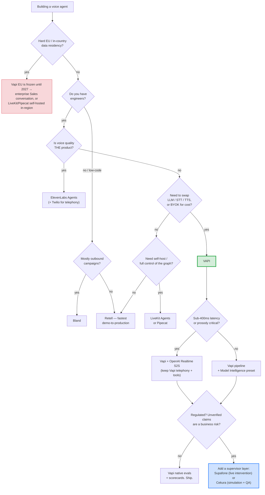

# VOICE_README

A working engineer's deep dive into **Vapi** (the voice-agent orchestration platform) and
**Supafone Labs** (the supervisor / second-mind layer that runs beside a live call), plus
the surrounding competitive landscape and the compression techniques that decide whether
your per-minute cost is $0.13 or $0.31.

This is written to be read top-to-bottom once and then used as a reference. It goes from
"what is a voice agent" to "here is the webhook contract, the failure isolation boundary,
and the cost model."

Everything factual here traces back to the vendor docs and the public Supafone Labs source
tree, both read on **30 August 2026**. Voice AI moves fast; re-verify the pricing and the
provider matrices before you commit an architecture to them.

---

## Table of contents

**Part I — Foundations**
1. [Why voice agents are hard (the latency budget)](#1-why-voice-agents-are-hard-the-latency-budget)
2. [Anatomy of one conversational turn](#2-anatomy-of-one-conversational-turn)
3. [The three architectural families](#3-the-three-architectural-families)

**Part II — Vapi, end to end**
4. [What Vapi actually is](#4-what-vapi-actually-is)
5. [The object model](#5-the-object-model)
6. [Full pipeline architecture](#6-full-pipeline-architecture)
7. [Transport and telephony](#7-transport-and-telephony)
8. [The orchestration layer (the part you can't replace)](#8-the-orchestration-layer-the-part-you-cant-replace)
9. [The webhook contract — every server event](#9-the-webhook-contract--every-server-event)
10. [Tools](#10-tools)
11. [Knowledge retrieval](#11-knowledge-retrieval)
12. [Squads: multi-assistant orchestration](#12-squads-multi-assistant-orchestration)
13. [Live call control](#13-live-call-control)
14. [Observability: evals, simulations, scorecards](#14-observability-evals-simulations-scorecards)
15. [Security, data flow and compliance](#15-security-data-flow-and-compliance)
16. [Vapi failure modes and gotchas](#16-vapi-failure-modes-and-gotchas)

**Part III — Supafone Labs, end to end**
17. [The thesis: one mind on a stopwatch](#17-the-thesis-one-mind-on-a-stopwatch)
18. [Two pillars: Agent Factory and Supervisor](#18-two-pillars-agent-factory-and-supervisor)
19. [TAP → THINK → WHISPER](#19-tap--think--whisper)
20. [The canonical runtime: events, state, decisions](#20-the-canonical-runtime-events-state-decisions)
21. [The adapter matrix — 14 runtimes, 5 support classes](#21-the-adapter-matrix--14-runtimes-5-support-classes)
22. [Programmable directive contracts](#22-programmable-directive-contracts)
23. [Transcript authority — the one-source rule](#23-transcript-authority--the-one-source-rule)
24. [The Cloud API and the Hosted Agents API](#24-the-cloud-api-and-the-hosted-agents-api)
25. [Degrade safety](#25-degrade-safety)
26. [Pricing and metering](#26-pricing-and-metering)
27. [The research lineage](#27-the-research-lineage)

**Part IV — Putting them together**
28. [Reference architecture: Vapi + Supafone](#28-reference-architecture-vapi--supafone)
29. [End-to-end call sequence](#29-end-to-end-call-sequence)
30. [The build ladder: level 0 → level 6](#30-the-build-ladder-level-0--level-6)

**Part V — Economics and landscape**
31. [Compression: audio, context, and cost](#31-compression-audio-context-and-cost)
32. [Competitors and where each one wins](#32-competitors-and-where-each-one-wins)
33. [Decision tree](#33-decision-tree)
34. [Production readiness checklist](#34-production-readiness-checklist)
35. [Glossary](#35-glossary)
36. [Sources](#36-sources)

---
---

# Part I — Foundations

## 1. Why voice agents are hard (the latency budget)

A text chatbot can think for four seconds and nobody minds. A voice agent that pauses for
four seconds gets hung up on.

The number everyone optimizes against is **voice-to-voice latency**: the wall-clock gap
between the moment the caller stops talking and the moment the first syllable of the reply
reaches their ear. Vapi's own target for this is under 500–700ms, and it advertises
sub-600ms response times as achievable on the platform. Independent 2026 comparisons put
Retell around 600ms, Vapi around 700ms, Bland around 800ms in practice. Human callers start
to notice awkwardness past roughly 800ms and start abandoning past a second.

Here's where that budget goes on a classic pipeline agent:

```
 caller stops speaking
 │
 ├─ 100–300ms   endpointing decision ("are they actually done, or just breathing?")
 ├─  50–150ms   final STT transcript settles
 ├─  20– 60ms   orchestrator assembles prompt, routes to LLM
 ├─ 200–800ms   LLM time-to-first-token  ◄── the biggest and most variable slice
 ├─  80–250ms   TTS time-to-first-audio-byte
 ├─  20–120ms   network + jitter buffer + telephony transcoding
 ▼
 caller hears first syllable
```

Two consequences fall directly out of this diagram, and they explain almost every design
decision in the rest of this document:

**Consequence 1 — the model that talks cannot afford to think.** Any reasoning you add to
the speaking model's prompt shows up as time-to-first-token. This is why long, elaborate
"do everything" system prompts fail in production: they're not just expensive, they're
audibly slow. It's also the entire premise of Supafone Labs (Part III) and a large part of
the premise of Vapi Squads (§12).

**Consequence 2 — endpointing is a model, not a timer.** Naive silence detection either
cuts people off mid-thought or waits half a second after every utterance. Vapi runs a
proprietary endpointing model that fuses audio and partial-text signals to decide when a
turn actually ended. You cannot replace it, and that's deliberate — it's the core of what
they sell (§8).

---

## 2. Anatomy of one conversational turn



Three things in this diagram are worth internalizing:

- **Everything streams.** STT streams partials, the LLM streams tokens, TTS streams audio.
  A pipeline that waits for a complete transcript, then a complete LLM response, then a
  complete audio file will be 2–3× slower than one that pipelines at sentence boundaries.
- **Tool calls are a latency cliff.** A tool call inserts a full round trip to your backend
  *inside* the turn. A 900ms CRM lookup doubles your response time. This is why Vapi has a
  whole sub-section of docs on API-request tool reliability, retries and "say something
  while I work on this" messages.
- **Barge-in is a classification problem.** "Uh-huh" and "wait, no" are both the caller
  speaking over the agent. One should be ignored, one should stop playback immediately.

---

## 3. The three architectural families

Before picking a vendor, know which of these three you're buying, because the failure modes
differ completely.

| | **A. Cascading pipeline** | **B. Speech-to-speech (S2S)** | **C. Framework / DIY** |
|---|---|---|---|
| Shape | STT → LLM → TTS as separate services | one multimodal model in, audio out | you assemble the graph yourself |
| Examples | Vapi, Retell, Bland, ElevenLabs Agents, Deepgram Voice Agent | OpenAI Realtime, Gemini Live, Grok Voice, Ultravox | LiveKit Agents, Pipecat |
| Swap components? | yes, per-component | no — it's one model | yes, everything |
| Text transcript | native, free | derived, sometimes lossy | yours |
| Prosody / emotion | lost at the STT boundary, partially recovered by side models | preserved end to end | depends |
| Latency floor | sum of three hops | single hop, lowest | whatever you build |
| Where you inject mid-call context | prompt patch / message insert | native session event | you own the context object |
| Debuggability | high (text at every seam) | low (audio in, audio out) | highest (it's your code) |
| Typical cost shape | orchestration fee + per-provider metering | one blended per-minute | infra + per-provider |

Vapi is family A with an escape hatch into family B (it supports OpenAI realtime
speech-to-speech as a model option). Supafone Labs is deliberately *orthogonal* to all
three — it adapts to whichever one you run.

**The practical rule:** family A when you need transcripts, compliance, provider swapping
and debuggability (which is most enterprise work). Family B when raw latency and prosody
are the product. Family C when you have a platform team and a five-year horizon.

---
---

# Part II — Vapi, end to end

## 4. What Vapi actually is

Strip the marketing and Vapi is **an orchestration layer over three swappable modules**:
a transcriber, a model, and a voice. It takes those three, optimizes the latency between
them, manages streaming and scaling, and runs a set of proprietary real-time models on top
that make the conversation feel human rather than walkie-talkie.

That's the honest one-sentence version. What you're paying the $0.05/min orchestration fee
for is *not* STT, LLM or TTS — you can buy all three yourself. You're paying for:

1. the turn-taking machinery (endpointing, barge-in, backchannel)
2. the telephony/SIP plumbing and the number lifecycle
3. the tool-calling and transfer runtime
4. the artifact pipeline (recordings, transcripts, structured outputs)
5. the fact that all of it survives 62M calls a month

Vapi's provider surface is wide — a dozen-plus STT vendors, seventeen-ish LLM vendors, and
close to twenty TTS vendors, all selectable per assistant. It also ships **Model
Intelligence presets** that bundle a matched transcriber/model/voice triple for a common
use case, which is the sane default before you start tuning.

### Two building primitives

Vapi gives you exactly two ways to build, and the docs are clear about when to use which:

- **Assistants** — one system prompt, plus tools and structured outputs. This is the
  default. Customer support, lead qualification, booking, routing.
- **Squads** — multiple specialized assistants that hand off to each other mid-call with
  context preserved. Medical triage, e-commerce order/return/VIP routing, property
  management. (Legacy "Workflows" are being migrated into Squads.)

Start with an Assistant. Move to a Squad only when there is a *clear functional boundary*,
not just because the prompt got long. See §12 for why.

---

## 5. The object model



### Transient vs permanent

This distinction bites everyone once, so learn it early.

- **Permanent** — you `POST /assistant`, get back an `assistantId`, and reference that ID
  from calls, squads and phone numbers. Versioned, reusable, dashboard-visible.
- **Transient** — you inline the entire assistant JSON blob into the call-creation request
  (or into your `assistant-request` webhook response). Nothing is stored server-side.

Transient is the right choice when the assistant is genuinely per-call — personalized
prompt, per-tenant tool endpoints, dynamic knowledge. Permanent is right when you want
versioning, A/B comparison across calls, and dashboards that group cleanly.

The hybrid that most teams land on: **permanent assistant + `assistantOverrides`**. You
keep one versioned assistant and patch the variable parts at call time. In a Squad you get
two override layers — `assistantOverrides` (one member) and `memberOverrides` (all members,
useful for forcing a single voice across the squad without editing each assistant).

There is also a `tools:append` form inside `assistantOverrides`, which lets you attach a
handoff tool that exists *only* within this squad — so the same saved assistant behaves
differently depending on which squad it's serving in. That's the cleanest way to avoid the
"one assistant, forty handoff tools" mess.

### Dynamic variables

`{{variableName}}` placeholders in prompts and first messages, filled at call time from
`assistantOverrides.variableValues`. Vapi also injects defaults like `{{now}}`,
`{{customer.number}}`, `{{phoneNumber.number}}`. Use these instead of regenerating prompt
text per call — it keeps prompt caching effective (§31).

---

## 6. Full pipeline architecture



The single most important thing this diagram tells you: **the orchestration box is the
product**. Transport, STT, LLM, TTS and storage all have a BYOK path and most have a
"custom server" path. Orchestration has neither. That's the moat, and it's also the
compliance boundary you have to accept if you use Vapi at all (§15).

---

## 7. Transport and telephony

| Transport | What it's for | Audio format |
|---|---|---|
| **SIP** | PBX integration, BYO carrier, enterprise trunking | typically μ-law 8k |
| **Telephony** (Twilio / Telnyx / Plivo / Vonage / DIDWW) | ordinary PSTN numbers | μ-law 8-bit 8kHz |
| **WebSocket** | custom apps, server-side audio | PCM 16-bit 16kHz |
| **WebRTC** | browser and mobile, via LiveKit/Daily | PCM 16-bit 16kHz |

Vapi supports two audio profiles: **PCM 16-bit / 16kHz** (highest quality) and **μ-law
8-bit / 8kHz** (the telephony standard). See §31 for what that codec choice does to your
STT accuracy and your bandwidth.

Number acquisition has four routes, in increasing order of control:

1. **Free Vapi number** — instant, good for dev, not for production.
2. **Import a Twilio/Telnyx/DIDWW number** — you own the carrier relationship and the
   caller-ID reputation; Vapi routes it.
3. **Full SIP trunk** — you bring the carrier entirely. There's a documented networking
   and firewall page for this; budget real time for it if you're behind an enterprise
   perimeter.
4. **SIPREC / forked media** — for compliance recording paths and for taps like Supafone's.

**Phone Number Hooks** let you attach behavior at the number level rather than the
assistant level — useful when one number fronts many tenants.

**Concurrency is a purchased resource.** Vapi sells call concurrency as a line item and
has a dedicated queue-management page. If you're planning an outbound campaign, model your
concurrency ceiling *before* you build the dialer, not after.

---

## 8. The orchestration layer (the part you can't replace)

Seven proprietary real-time models run inside Vapi's infrastructure on every call:

| Model | Job | Why it matters |
|---|---|---|
| **Endpointing** | decides the caller finished, using audio + text fusion | the single biggest lever on perceived latency |
| **Interruption detection** | distinguishes a real barge-in from "uh-huh" | bad barge-in makes an agent feel deaf or twitchy |
| **Background noise filtering** | strips ambient sound in real time | call quality on mobile/street/car |
| **Background voice filtering** | isolates the primary speaker from TVs, echoes, bystanders | stops the agent answering the television |
| **Backchanneling** | injects "mm-hm", "got it" | makes silence during thinking feel like listening |
| **Emotion detection** | reads emotional tone, passes it into LLM context | lets the prompt react to a frustrated caller |
| **Filler injection** | adds "um", "so", natural disfluency | masks time-to-first-token |

Two properties worth writing on a wall:

- **These are not customizable.** No BYOK, no custom server. If your compliance posture
  requires that *no* audio touches a third party, Vapi is out — orchestration always sees
  the stream.
- **Their processing is ephemeral.** Audio and intermediate results are not persisted by
  these models. Only final transcripts and call logs get stored.

You *can* influence the layer from the outside:

- `startSpeakingPlan` / `stopSpeakingPlan` — tune the endpointing and interruption
  thresholds per assistant.
- `smartEndpointingPlan.server.url` — **run your own endpointing decision.** Vapi will POST
  a `call.endpointing.request` with the conversation so far, and you reply with
  `{"timeoutSeconds": 0.5}`. This is the escape hatch for domain-specific turn-taking
  (someone reading out a 16-digit account number needs a very different endpointing policy
  than someone answering yes/no).
- `backgroundSpeechDenoisingPlan`, pronunciation dictionaries, custom keywords — all shape
  what the layer does without replacing it.

---

## 9. The webhook contract — every server event

This is the section to bookmark. Everything you integrate with Vapi flows through here.

**Envelope.** Every server message is a `POST` to your Server URL with this shape:

```jsonc
{
  "message": {
    "type": "<server-message-type>",
    "call": { /* Call object */ },
    // + type-specific fields
    // + common metadata: phoneNumber, timestamp, artifact, assistant, customer, chat
  }
}
```

**Most events are fire-and-forget.** Only four types expect a response body:

| Type | You must return | Deadline |
|---|---|---|
| `assistant-request` | `assistantId` \| `assistant` \| `destination` \| `error` | **7.5s end-to-end, hard** |
| `tool-calls` | `{ "results": [ { name, toolCallId, result } ] }` | within the turn |
| `transfer-destination-request` | `{ destination, message? }` | within the turn |
| `knowledge-base-request` | `{ documents: [ { content, similarity, uuid } ] }` | within the turn |

Two more are routed to *dedicated* URLs rather than the main Server URL:
`voice-request` → `assistant.voice.server.url`, and `call.endpointing.request` →
`assistant.startSpeakingPlan.smartEndpointingPlan.server.url`.

### The 7.5-second rule

`assistant-request` fires on an inbound call to a number that has no `assistantId` bound.
The budget is **7.5 seconds end-to-end and it is not configurable**: the telephony provider
enforces a 15-second cap and Vapi reserves about half for call setup. The timeout you see
in the dashboard does not apply here.

The correct pattern, straight from the docs:

> return fast with an existing `assistantId` or a minimal transient assistant, then enrich
> the context *asynchronously after the call has started* using Live Call Control.

Also: host the webhook near `us-west-2` and aim under ~6s to leave room for jitter. If you
are doing a database lookup, a CRM enrichment and an LLM call inside this handler, you have
already lost.

**Transfer-only shortcut:** returning a `destination` (number or SIP) in the
`assistant-request` response forwards the call immediately and ignores `assistantId`,
`assistant`, `squadId` and `squad` entirely. Set `destination.message` to `""` for a silent
transfer. This is how you build a pure router with no AI in the path — and it's how you
implement spam rejection.

### Complete event catalogue

| Event `type` | Fires when | Response? | Primary use |
|---|---|---|---|
| `assistant-request` | inbound call needs an assistant | **required** | dynamic routing, multi-tenant |
| `status-update` | lifecycle change | no | `scheduled` → `queued` → `ringing` → `in-progress` → `forwarding` → `ended` |
| `transcript` | partial + final transcripts, per role | no | live UI, external supervisor tap |
| `speech-update` | speech `started` / `stopped`, with `turn` | no | turn accounting |
| `assistant.speechStarted` | assistant begins each spoken segment | no | **opt-in**; live captions, word highlighting |
| `model-output` | tokens / tool-call output as generated, with `turnId` | no | streaming UI, token-level tracing |
| `conversation-update` | history committed; includes `messagesOpenAIFormatted` | no | mirroring conversation to your store |
| `tool-calls` | model invoked a tool | **required** | your business logic |
| `transfer-destination-request` | model wants to transfer, destination unknown | **required** | dynamic routing to a queue/agent |
| `transfer-update` | a transfer happened | no | CRM logging |
| `user-interrupted` | barge-in; carries `turnId` | no | discard that turn's tokens |
| `language-change-detected` | transcriber switched language | no | multilingual UX, voice switching |
| `hang` | the assistant is stalling | no | alerting — this is your canary |
| `phone-call-control` | hangup/forward delegated to you | no | advanced call control |
| `knowledge-base-request` | custom KB provider configured | **required** | your own RAG |
| `voice-input` | custom voice provider text | no | custom TTS |
| `voice-request` | custom voice server: text + sampleRate | **raw PCM back** | custom TTS |
| `call.endpointing.request` | custom endpointing server | `{timeoutSeconds}` | domain turn-taking |
| `end-of-call-report` | call finished | no | **the workhorse** — recording, transcript, messages, `endedReason` |
| `chat.created` / `chat.deleted` | chat lifecycle | no | text-channel parity |
| `session.created` / `.updated` / `.deleted` | session lifecycle | no | multi-turn session state |

### `assistant.speechStarted` — the caption event

Worth calling out because the semantics are subtle and provider-dependent. It's opt-in
(add it to `serverMessages` and/or `clientMessages`). The `text` field is **cumulative for
the turn, not a delta**. `timing` varies:

- **ElevenLabs** → `timing.type: "word-alignment"` with `words[]`, `wordsStartTimesMs[]`,
  `wordsEndTimesMs[]`, arriving at playback cadence (~50–200ms apart). The `words[]` array
  includes space entries with real timing — join them and track a character cursor. No
  client-side interpolation needed. **This is the only provider that supports true smooth
  real-time word highlighting.**
- **MiniMax** (with `voice.subtitleType: "word"`) → `timing.type: "word-progress"`, a
  cursor-based per-*segment* progress. MiniMax only attaches subtitle data to the final
  audio chunk of a synthesis segment, so events land near the *end* of a segment's playback.
  `wordsSpoken` jumps in segment-sized increments. Useful for retroactive animation, not for
  smooth live highlighting. Guard against `totalWords: 0` on the first event of a turn.
- **Everyone else** (Cartesia, Deepgram, Azure, OpenAI, Inworld…) → text only, one event per
  TTS chunk gated to playback. Render as a caption block or interpolate a cursor at roughly
  3.5 words/sec.

Behavioral edges: `force-say` events (firstMessage, queued `say` actions) are always
text-only even on ElevenLabs. On barge-in, **no further events fire for that turn** — pair
with `user-interrupted` and use the last `wordsSpoken` to know what was actually heard.
There is no `assistant.speechStopped`; detect end-of-turn via `speech-update`
(`status: "stopped"`) or a `turn` increment.

### Webhook hygiene

- **Authenticate.** Vapi supports server authentication (shared secret header / signature)
  and JWT. Turn it on. Your Server URL is a public POST endpoint that can start calls and
  return transfer destinations.
- **Encrypt tool arguments** if they carry PII — Vapi has argument encryption for exactly
  this.
- **Idempotency.** Key on `call.id` + `toolCall.id`. Retries happen.
- **Return 200 fast, work async.** Anything not in the four "response required" types
  should be acknowledged immediately and queued.
- **Local dev** uses the tunnel workflow in the "Developing locally" page — or the Vapi CLI,
  which has a `listen` mode.

---

## 10. Tools

Tools are how a voice agent stops being a demo. Vapi's tool taxonomy:

### Built-in call tools
Shipped with the platform, no code required:

| Tool | Purpose |
|---|---|
| `endCall` | hang up when the conversation is complete |
| `transferCall` | blind or warm transfer to a number, SIP URI, or assistant |
| `handoff` | move to another assistant inside a Squad (§12) |
| `dtmf` | press keypad digits — the key to IVR navigation |
| `voicemail` | leave a message when an answering machine is detected |
| `sms` | send a text mid-call |
| `queryTool` | search an attached knowledge base |

### API Request tool
A declarative HTTP call — no server of your own required. You define method, URL, headers,
body schema, and response mapping in the tool JSON. Vapi's docs split this across five
pages, and the reason is instructive: **configuration, reliability (latency and retries),
response handling and errors, and using response data**. That page split is a tell that
API-request latency is the number-one source of bad voice UX in production.

Design rules that follow:
- Target p95 under 500ms for anything called mid-turn. Beyond that, use a filler message.
- Set an explicit timeout and an explicit failure message. Never let a tool timeout become
  silence.
- Prefer one fat call over three chatty ones. Every round trip is audible.

### Custom tools
The classic path: define a JSON-schema function, and Vapi POSTs `tool-calls` to your Server
URL. You reply:

```json
{
  "results": [
    { "name": "lookupOrder", "toolCallId": "abc123", "result": "{\"status\":\"shipped\"}" }
  ]
}
```

Note `result` is a **string** — usually a JSON string. You can optionally include a message
for the assistant to speak while or after the tool runs. And you can design a tool to be
asynchronous: acknowledge immediately, push the real result later via Live Call Control.

### Code tool
Run a snippet inside Vapi rather than on your infrastructure. Good for pure transformations
(date math, formatting, unit conversion) where a network hop isn't worth it.

### Client-side tools (Web SDK)
The tool executes **in the browser**, not on a server. This is the right way to do things
that are inherently client-side: navigate the SPA, fill a form field, open a modal, read
something out of local app state. For a voice-controlled web app this is the highest-value
tool type and the most underused.

### MCP
Vapi exposes an MCP surface, so a Vapi assistant can consume tools from MCP servers.
For anyone already running MCP servers, this is the shortest path from "our agents can do X"
to "our *phone* agents can do X" — you get one tool contract across text and voice channels
instead of maintaining a parallel HTTP tool layer.

### Prebuilt integrations
Google Calendar, Google Sheets, Slack, GoHighLevel — configured, not coded.

### Reliability primitives
- **Tool rejection plan** — declare conditions under which a tool call should be refused
  before it executes. Cheap guardrail.
- **Static variables and aliases** — bind values that shouldn't come from the model.
- **Argument encryption** — encrypt tool arguments in transit for PII.
- **Versioning** — tools are versioned independently of assistants, and there's a documented
  story for versioning both together.

---

## 11. Knowledge retrieval

Three levels:

1. **Attached knowledge base + `queryTool`** — upload documents, Vapi handles chunking,
   embedding and retrieval. Zero infrastructure. Right answer for FAQ-shaped content.
2. **Custom knowledge base** — set `assistant.knowledgeBase.provider = "custom-knowledge-base"`.
   Vapi sends you a `knowledge-base-request` with the conversation so far (both raw and
   OpenAI-formatted), and you return documents:

   ```json
   {
     "documents": [
       { "content": "Return policy is 30 days...", "similarity": 0.92, "uuid": "doc-1" }
     ]
   }
   ```

   This is where you plug in your existing hybrid retrieval + reranking stack. The
   `similarity` field matters — Vapi uses it for ordering and inclusion.
3. **Retrieval as a tool** — don't use the KB slot at all; expose retrieval as an ordinary
   custom tool. More control over when retrieval fires, at the cost of the model having to
   decide to call it.

**The voice-specific RAG constraint nobody warns you about:** a chunk that reads fine on a
screen is unlistenable when spoken. Retrieved content in a voice agent needs to be
*shorter and flatter* than in a chat agent — no nested bullets, no tables, no "see figure 3".
If you're reusing a chat RAG pipeline, add a voice-specific rewrite step or your agent will
recite a paragraph nobody can follow. Budget 40–60 spoken words per retrieved fact, not 300.

---

## 12. Squads: multi-assistant orchestration

### Why Squads exist

Vapi's own justification is refreshingly concrete. Large all-in-one assistants with long
prompts produce:

- **higher hallucination rates** — models lose focus with too many, sometimes conflicting,
  instructions
- **increased cost** — longer prompts, more tokens per request
- **greater latency** — bigger contexts take longer to process, and that lands directly in
  the time-to-first-token slice of §1

A Squad splits the prompt into focused assistants with their own tools and goals, while
preserving conversation context across handoffs.

### Structure



The first member in `members[]` starts the call. Members are either `assistantId`
(permanent) or an inline `assistant` object (transient), and you can mix.

### Handoff tools

The recommended mechanism. A `handoff` tool declares `destinations[]`, each with a
`description` that tells the model *when* to use it:

```json
{
  "type": "handoff",
  "destinations": [
    {
      "type": "assistant",
      "assistantId": "assistant-123",
      "description": "Call this tool when the customer wants to talk about pricing"
    }
  ],
  "function": { "name": "handoff_to_assistant_123" }
}
```

That `description` is the routing logic. It is prompt engineering, and it is where squads
go wrong. Write exact trigger conditions and state what must be collected *before*
transferring. Reinforce it in the assistant's system prompt too — don't rely on the tool
description alone.

### Context engineering — the part that actually matters

By default the next assistant sees the conversation so far. As a call grows this becomes a
problem: more tokens, more latency, and **context poisoning** — an earlier assistant's
mistaken assumption propagating into a specialist that would otherwise have got it right.

Vapi gives you two levers:

- **`contextEngineeringPlan`** — control what history crosses the handoff boundary.
  `"none"` passes nothing; other modes pass windows or summaries. The Live Call Control
  `handoff` payload takes this field too.
- **Variable extraction** — pull structured facts out of the conversation at handoff time
  and pass *those* forward instead of raw turns.

The pattern that scales: **hand off a summary plus a typed fact bundle, not a transcript.**

```
Triage → Booking
  DON'T: 34 turns of raw conversation
  DO:    { intent: "reschedule", patient_id: "P-4471",
           current_appt: "2026-09-03T14:00", urgency: "routine",
           language: "es-MX", summary: "Caller wants to move Thursday's
           follow-up to the following week; no new symptoms." }
```

**Silent handoffs** exist for when you don't want the caller to hear a transition at all.

### Squad sizing heuristics

From the docs plus hard experience:

- 1–3 goals per assistant, maximum.
- Only give an assistant the tools it needs. Tool count is a latency and confusion tax.
- Split on **functional boundaries** (qualification → sales → booking), not on prompt length.
- Fewer members is better. A five-member squad where two members handle 95% of calls is a
  two-member squad with dead code.
- Every member needs a defined "I can't help with this" exit, or you get handoff loops.

---

## 13. Live call control

This is the feature that makes external supervision (Part III) possible, so understand it
precisely.

When you create a call, the response includes a `monitor` object:

```json
{
  "id": "7420f27a-30fd-4f49-a995-5549ae7cc00d",
  "status": "queued",
  "phoneCallTransport": "pstn",
  "monitor": {
    "listenUrl":  "wss://…vapi.ai/<call-id>/transport",
    "controlUrl": "https://…vapi.ai/<call-id>/control"
  }
}
```

### `controlUrl` — six actions

| Action | Payload | Effect |
|---|---|---|
| **say** | `{"type":"say","content":"…","endCallAfterSpoken":false}` | assistant speaks this text now |
| **add-message** | `{"type":"add-message","message":{"role":"system","content":"…"},"triggerResponseEnabled":true\|false}` | inject into conversation history |
| **control** | `{"type":"control","control":"mute-assistant"\|"unmute-assistant"\|"say-first-message"}` | assistant behavior |
| **end-call** | `{"type":"end-call"}` | hang up |
| **transfer** | `{"type":"transfer","destination":{…},"content":"…"}` | to number or SIP URI |
| **handoff** | `{"type":"handoff","destination":{"type":"assistant","contextEngineeringPlan":"none","assistant":{…}},"content":"…"}` | swap assistant mid-call |

**`add-message` with `triggerResponseEnabled: false` is the whisper primitive.** It puts a
system message into the live conversation without making the assistant say anything. The
next time the model generates, that instruction is in its context. The caller hears nothing.

That single flag is the entire integration surface between Vapi and any external supervisor.
Set it to `true` and you get the opposite behavior — inject *and* force a response — which
is what you want for a repair prompt ("you misheard the email address, ask them to spell it").

### `listenUrl` — raw audio tap

A WebSocket that streams the live call. Binary frames are PCM; text frames are JSON control
messages. Node sketch:

```js
const ws = new WebSocket(monitor.listenUrl);
let pcm = Buffer.alloc(0);
ws.on('message', (data, isBinary) => {
  if (isBinary) pcm = Buffer.concat([pcm, data]);
  else handleControl(JSON.parse(data.toString()));
});
```

Use cases: live compliance monitoring, real-time supervisor dashboards, feeding a separate
STT for language detection, or archiving raw audio to your own bucket in parallel with
Vapi's recording.

**Cost note:** if Vapi's transcriber is already producing transcripts, running your own STT
off `listenUrl` means paying for transcription twice. Supafone codifies this as a hard rule
(§23) — for Vapi specifically, use Vapi's transcripts and skip the tap.

---

## 14. Observability: evals, simulations, scorecards

Vapi ships more testing infrastructure than most voice platforms, and this is a real
differentiator for regulated work.

| Capability | What it does | When to use |
|---|---|---|
| **Evals** | assertions over call outcomes | regression gate in CI |
| **Simulations** | an AI tester places calls against your agent with a persona and a goal | pre-release load and behavior testing |
| **AI tester config** | define the synthetic caller's persona, objective, difficulty | edge-case coverage |
| **Test suites** | grouped chat + voice test cases | release gating |
| **Scorecard** | rubric-based scoring of completed calls | quality tracking over time |
| **Structured outputs** | typed JSON extracted from the call against a schema | the machine-readable call result |
| **Boards** | dashboards over calls and metrics | ops visibility |
| **Monitoring** | live call monitoring | on-call |
| **Langfuse integration** | trace export | if you already run Langfuse |

**Structured outputs deserve special attention.** Define a JSON schema on the assistant;
Vapi extracts conforming data from the conversation and hands it back in the artifact. This
turns "the call happened" into "the call produced `{appointment_id, confirmed: true,
callback_requested: false}`" — which is what your downstream systems actually need. It's also
the natural key for eval assertions: assert on extracted fields, not on transcript substrings.

**A word on what evals should assert.** Transcript-matching evals rot instantly. Assert on:
- structured output correctness
- tool call presence, ordering, and arguments
- `endedReason` distribution
- turn count and call duration percentiles
- whether unverified claims were made (did the agent say "you're booked" without a
  successful booking tool result?)

That last one is exactly the class of failure Supafone's truth-state tracking targets (§20).

**Call analysis** (summary + success evaluation + structured data) runs post-call and is
configurable per assistant. **Call recording** is configurable including a recording consent
plan. **Retrieve call artifacts** covers pulling recordings, transcripts and messages after
the fact.

---

## 15. Security, data flow and compliance

### Two log types — know the difference

| | **Call logs** | **System logs** |
|---|---|---|
| Contains | transcripts, recordings, call metadata | infra-level operational data |
| You can see them | yes, API + dashboard | no, Vapi internal only |
| Can go to your bucket | **yes** | **never** |

System logs never leave Vapi. This is non-negotiable and it is the answer to "can we get
100% of our data?" — no, and the residual is operational telemetry rather than call content.

### Bring-your-own matrix

| Component | BYOK (your API key) | Custom server |
|---|---|---|
| Transport | ✅ Twilio, Telnyx, Vonage, etc. | ✅ WebSocket / SIP |
| Transcriber | ✅ most providers (Deepgram, Gladia, AssemblyAI, Speechmatics, Google, Azure) — **not** Talkscriber | ✅ Custom Transcriber over WebSocket |
| **Orchestration** | ❌ **Vapi only** | ❌ **Vapi only** |
| LLM | ✅ all providers | ✅ Custom LLM via OpenAI-compatible endpoint |
| Voice | ✅ all providers | ✅ Custom TTS via audio streaming endpoint |
| Storage | ✅ S3 / GCS / R2 / Azure / Supabase | ✅ same |

### What still passes through Vapi at maximum lockdown

| Data | Processing | Retention |
|---|---|---|
| Raw audio streams | routed to transcriber/voice | **ephemeral** |
| Transcribed text | orchestration analysis, LLM routing | call logs |
| LLM responses | filler injection, voice routing | call logs |
| Emotion metadata | passed into LLM context | **ephemeral** |
| Call signaling | SIP/WebSocket management | metadata only |

### Compliance posture

- **SOC 2** — yes, with a public trust center.
- **HIPAA mode** — org-level toggle. Recordings, transcripts and call logs are retained by
  default in Vapi's private HIPAA-compliant storage; custom storage is *optional*, not
  required, and redirects rather than disables retention. Only HIPAA-eligible providers may
  be used in the pipeline.
- **PCI** — documented handling for payment data.
- **GDPR** — documented, but read the next bullet.
- **Zero Data Retention (ZDR)** — available.
- **EU data residency — read this carefully.** Vapi's EU support and self-serve growth are
  **frozen until 2027**. Existing EU customers keep their accounts, but no new add-ons and
  no guaranteed feature parity with US. New self-serve customers are directed to the US
  region. Vapi-hosted EU residency now requires a Sales conversation and selective
  enterprise onboarding. **If you have a hard EU-residency requirement, this is a
  procurement blocker, not a config flag.** The workaround Vapi documents is custom bucket
  storage in-region + in-region custom LLM and TTS — but orchestration still runs on Vapi's
  US/EU infra (ephemerally) and system logs still stay with Vapi.
- **Static IPs** and a **proxy server guide** exist for enterprise egress control.
- **SSO** and **JWT authentication** for dashboard and API access.
- **TCPA consent guidelines** — read before any outbound campaign in the US. This is a legal
  exposure, not a technical one.

### Maximum-control configuration

If your security team asks "what's the tightest we can run this?", the answer is:

```
Custom Transcriber (WebSocket)  →  your STT
Custom LLM (OpenAI-compatible)  →  your model, your VPC
Custom TTS (audio streaming)    →  your voices
Custom bucket storage           →  your S3/GCS
HIPAA mode enabled              →  no Vapi-side call log retention beyond policy
Static IPs + proxy              →  controlled egress
Argument encryption             →  PII in tool calls protected
```

Residual: orchestration signals (ephemeral) transit Vapi, and system logs stay with Vapi.

---

## 16. Vapi failure modes and gotchas

Collected from the docs' own troubleshooting pages plus the shape of the platform.

| Symptom | Likely cause | Fix |
|---|---|---|
| Inbound calls drop instantly | `assistant-request` exceeded 7.5s | return an ID fast, enrich after start via Live Call Control |
| Agent talks over the caller | endpointing too aggressive | tune `startSpeakingPlan`; consider custom endpointing server |
| Long dead air before replies | LLM TTFT + oversized prompt | shorten prompt, split into a Squad, enable filler injection, use a faster model |
| Agent claims something that didn't happen | tool failed, model narrated success anyway | never let a failed tool return a success-shaped string; add an external truth check (§20) |
| Transfers silently drop | forwarding config / carrier | see "Debug forwarding drops"; check `transfer-update` events |
| Handoff loops between squad members | vague handoff descriptions, no exit condition | tighten descriptions, add explicit "cannot help" paths |
| Costs 3× the estimate | orchestration fee is only the floor | model the full stack (§31) |
| Wrong assistant on a shared number | no `assistantId` and slow `assistant-request` | bind assistants to numbers where possible; use Phone Number Hooks |
| Captions jump in chunks | non-ElevenLabs voice | expected — only ElevenLabs gives playback-cadence word timing |
| Duplicate transcripts / double billing | your own STT running off `listenUrl` alongside Vapi's transcriber | pick one transcript source |
| Spam calls burning concurrency | no screening | use the spam-call-rejection Server URL pattern |
| Calls queue and time out under load | concurrency ceiling | purchase concurrency; implement queue management |

**Call end reasons** get a whole documentation page for a reason. Instrument
`endedReason` distribution as a first-class metric — a shift in that distribution is
usually the earliest signal that something upstream broke.

**IVR navigation** has its own page: if your agent has to call *other* companies' phone
trees, you need DTMF tooling and a very different endpointing posture. It is a distinct
engineering problem from answering calls.

**Enterprise environments (DEV/UAT/PROD)** — Vapi documents a pattern for this. Use it.
Separate orgs/keys per environment, and never let a UAT assistant hold a production number.


---
---

# Part III — Supafone Labs, end to end

## 17. The thesis: one mind on a stopwatch

Supafone Labs makes an architectural argument, not a feature argument, and it's worth
stating in their framing before critiquing it.

> A voice agent is one mind on a stopwatch. To sound human it must answer in well under a
> second — which means the model that *talks* can never afford to *think*. And everything
> that decides whether a call succeeds is thinking.

The things that decide call outcomes — reading distress in a caller's voice, noticing they
just switched to Spanish, catching the agent about to promise something the API failed to
do, remembering that this firm never quotes fees on the phone — are all cross-turn reasoning.
The latency budget from §1 forbids all of it. Supafone's position: that's an architecture
problem, not a prompt-engineering problem.

Their analogy is the call-floor supervisor: a person with a headset who listens, says
nothing to the customer, and slides a note across the desk. *"She's scared, slow down."*
*"Stop — don't quote the fee."* *"The booking didn't go through, don't say it did."* The
agent keeps talking; the note changes the call. Nobody expects the person speaking to also
be the person supervising — yet that's exactly what a single-prompt voice agent is.

Two supporting arguments they make that are worth taking seriously:

**Why not just a better prompt?** Prompts are frozen at call start; calls are alive. The
moment that matters — the caller starts crying, the summary contradicts the tool result,
the language flips — is by definition the moment your prompt didn't anticipate.

**Why a separate model at all rather than more reasoning in the same one?** Because the
speaking model is structurally conflicted. More reasoning adds latency; less reasoning
misses the moment. Splitting the roles is the only way to have both.

Their own comparison table:

```
speaking model                          supervisor model
--------------                          ----------------
fast, natural response                  slower cross-turn reasoning
owns the customer audio                 never speaks to the customer
uses tools and follows stages           checks tool truth and stage progress
continues if supervisor is absent       emits a bounded silent directive or no-op
```

### "Empathy" as observable state, not vibes

The part that makes this implementable rather than hand-wavy: Supafone defines empathy as a
set of tracked, observable variables rather than a personality adjective.

| Variable | What it tracks |
|---|---|
| **intent** | what outcome the caller is actually trying to reach |
| **urgency** | whether waiting, escalation, or a shorter path matters |
| **emotion** | confusion, frustration, fear, confidence, relief — across turns |
| **language** | an explicit request or clear utterance in an approved language |
| **trust** | whether the agent acknowledged, verified, and followed through |
| **progress** | whether the current workflow stage is advancing or looping |
| **truth** | whether a booking, transfer, send, or CRM action actually succeeded |

And an explicit fairness constraint that is unusually well-stated for a vendor doc: the
supervisor **does not route from a name, accent, nationality, or presumed demographic.**
It waits for evidence, compares against the operator's objective and tool results, and only
whispers when a short directive is likely to improve the outcome.

**My honest read:** the "truth" variable is the one that justifies the whole architecture
for enterprise use. An agent confidently telling a customer their appointment is booked when
the booking API 500'd is a *business* failure, not a UX one, and it is structurally invisible
to the speaking model — the model has no idea the tool failed unless you engineered that in.
Everything else on the list is nice; that one is load-bearing.

---

## 18. Two pillars: Agent Factory and Supervisor

Supafone Labs is two products under one key, and conflating them causes confusion.

```
┌──────────────────────────────────────────────────────────────────┐
│  PILLAR 1 — AGENT FACTORY  (managed, the default path)           │
│                                                                  │
│  One Supafone key → complete inbound / outbound / web /          │
│  campaign agent, with managed numbers, managed voices,           │
│  generated call stages, built-in tools, and the Supervisor       │
│  already attached.                                               │
│                                                                  │
│  You do NOT need Twilio, Ultravox, Cartesia, Inworld,            │
│  ElevenLabs, Deepgram, OpenAI, Anthropic or xAI accounts         │
│  before your first working agent exists.                         │
└──────────────────────────────────────────────────────────────────┘
┌──────────────────────────────────────────────────────────────────┐
│  PILLAR 2 — SUPERVISOR / SELF-HEALING WATCHER  (the differentiator)│
│                                                                  │
│  Attach a second mind to an agent you ALREADY run — on Vapi,     │
│  Retell, Ultravox, OpenAI Realtime, LiveKit, Pipecat, Deepgram,  │
│  ElevenLabs, or your own stack. Observes transcripts, tools,     │
│  state and outcomes; sends silent corrective directives through  │
│  the provider's native control channel.                          │
└──────────────────────────────────────────────────────────────────┘
```

Their own docs are explicit that the *Factory* is intentionally secondary: "The defining
product is the supervisor contract, which also works when Supafone did not create the agent."

### The three BYOK lanes

These are deliberately separate, and they can be mixed:

| Lane | Covers | Examples |
|---|---|---|
| **Agent / provider stack** | the realtime agent or model runtime | Ultravox, Retell, **Vapi**, Bland, LiveKit, Pipecat, GPT Realtime, Grok |
| **Telephony** | carrier, trunk, phone-network credentials | Twilio, Telnyx, Plivo, SignalWire, SIP/custom trunks |
| **TTS** | voice rendering, voice-clone credentials | Cartesia, ElevenLabs, Inworld, Deepgram, custom TTS |

So a team can run Supafone-managed telephony with BYOK TTS, or BYOK Twilio with the managed
supervisor, or bring the entire stack and use Supafone only for supervision, logs and QA.
For anyone already on Vapi, that last configuration is the interesting one.

### The 60-second on-ramp

```bash
curl -X POST https://api.labs.supafone.ai/v1/signup \
  -H "Content-Type: application/json" -d '{"email": "you@company.com"}'
# -> { "key": "sl_live_…", "free_minutes": 5.0 }
export SUPAFONE_LABS_API_KEY=sl_live_…
```

```bash
pip install supafone-labs[all]
```

```python
import supafone_labs

brain = supafone_labs.supercharge(my_agent, scenario="legal_intake")
result = await brain.observe(raw_event)   # feed your platform's events
# result.actions -> the compiled native whisper (or [] if the oracle is quiet)
```

Three operating modes, same code:
- **hosted key set** → oracle, TTS and live multilingual STT run on Supafone infrastructure
- **no hosted key** → everything runs on your own vendor keys
- **neither** → deterministic offline fakes (this is what makes it CI-testable)

---

## 19. TAP → THINK → WHISPER

The architecture in their own ASCII, which is compact enough to keep:

```
                    ┌─────────────────────────────────────────────┐
your live call ────▶│  TAP        13+ platform adapters +         │
(any platform)      │             Deepgram nova-3 multilingual    │
                    │             STT for audio-only stacks       │
                    ├─────────────────────────────────────────────┤
                    │  THINK      belief state + coaching oracle  │
                    │             (off the latency path, timeout- │
                    │             bounded, degrade-safe)          │
                    ├─────────────────────────────────────────────┤
silent whisper ◀────│  WHISPER    compiled to the platform's      │
(native channel)    │             native control — never spoken   │
                    └─────────────────────────────────────────────┘
```

Expanded into the actual loop they document:



The two properties that make this safe to put next to production traffic:

1. **It's off the hot path.** The supervisor never sits between the caller and the agent.
2. **It's guarded at multiple stages.** Evidence gate, confidence threshold, cooldown,
   timeout. The default outcome is *nothing*, and nothing is a valid, tested outcome.

### The two whisper delivery modes

| Mode | Mechanism | Providers |
|---|---|---|
| **A — native silent event** | vendor event that adds context without triggering speech | Ultravox `send_data_message`/`inject_message`; OpenAI Realtime `conversation.item.create` *without* `response.create`; ElevenLabs `contextual_update`; Gemini Live `clientContent` |
| **B — own the LLM** | Supafone plugs in as the LLM and splices a `system`/`developer` message into the prompt | Retell and LiveKit custom-LLM loops |

**Vapi and Deepgram support both modes.** For Vapi, mode A maps onto the `add-message`
control action from §13 with `triggerResponseEnabled: false` — which is exactly what the
adapter emits.

---

## 20. The canonical runtime: events, state, decisions

This is where the abstraction earns its keep. Every provider gets normalized into the same
three structures, so the reasoning layer never learns provider trivia.

### Canonical events

```python
class EventTypes:
    SESSION_STARTED            = "session.started"
    SESSION_UPDATED            = "session.updated"
    SESSION_ENDED              = "session.ended"
    STAGE_TRANSITION           = "stage.transition"
    CALLER_TRANSCRIPT_PARTIAL  = "caller.transcript.partial"
    CALLER_TRANSCRIPT_FINAL    = "caller.transcript.final"
    AGENT_TRANSCRIPT_PARTIAL   = "agent.transcript.partial"
    AGENT_TRANSCRIPT_FINAL     = "agent.transcript.final"
    TOOL_CALLED                = "tool.called"
    TOOL_RESULT                = "tool.result"
    POLICY_TRIGGERED           = "policy.triggered"
    WATCHDOG_TRIGGERED         = "watchdog.triggered"
    CONSENT_UPDATED            = "consent.updated"
    BOOKING_UPDATED            = "booking.updated"
    DELIVERY_UPDATED           = "delivery.updated"
    RECORDING_AVAILABLE        = "recording.available"
    TRANSCRIPT_AVAILABLE       = "transcript.available"
    PROVIDER_ERROR             = "provider.error"
    PROVIDER_ACTION_EXECUTED   = "provider.action.executed"
```

### Runtime state — what the second mind actually remembers

```python
class RuntimeState(BaseModel):
    session_id:          str
    provider:            str
    provider_session_id: str = ""
    workflow_id:         str = "generic_support"
    current_stage:       str = "intake"
    transcript:          list[TranscriptTurn]   # actor, text, ts, partial, language
    tool_history:        list[ToolCallRecord]   # name, status, ts, request, result
    truth_state:         TruthState
    consent_state:       ConsentState
    delivery_state:      DeliveryState
    watchdog_state:      WatchdogState
    recording_state:     RecordingState
    provider_metadata:   dict
    trace_ids:           dict
    last_caller_text:    str
    last_agent_text:     str
```

The sub-states are where the domain logic lives:

```python
class TruthState(BaseModel):
    booking_requested:         bool = False
    booking_verified:          bool = False   # ← did a tool actually confirm it?
    delivery_requested:        bool = False
    delivery_verified:         bool = False
    end_call_claims_verified:  bool = True
    last_verified_tool:        str  = ""
    last_verified_at:          datetime | None = None
    last_unverified_claims:    list[str] = []

class ConsentState(BaseModel):
    sms_status:       str = "not_needed"    # consent gate before SMS delivery
    email_status:     str = "not_needed"
    recording_status: str = "unknown"

class DeliveryState(BaseModel):
    consultation_status: str = "not_sent"
    intake_form_status:  str = "not_sent"
    last_channel:        str = ""
    last_error:          str = ""
    repaired_fields:     dict[str, str] = {}   # e.g. spoken-email normalization

class WatchdogState(BaseModel):
    bridge_armed:    bool = False   # agent said "let me check that…"
    bridge_text:     str  = ""
    bridge_armed_at: datetime | None = None
    nudges_sent:     int  = 0       # cooldown counter
```

`WatchdogState.bridge_armed` is a lovely little detail: when the agent says a bridge phrase
("one moment while I look that up"), the watchdog arms. If nothing resolves within the
window, that's a stall the supervisor can act on. `nudges_sent` is the anti-nagging cooldown.

### Decision kinds — the abstract action vocabulary

Only six, deliberately:

```python
class DecisionKinds:
    INJECT_HIDDEN_INSTRUCTION    = "inject_hidden_instruction"
    FORCE_STAGE_TRANSITION       = "force_stage_transition"
    REQUEST_AVAILABILITY_WINDOW  = "request_availability_window"
    BLOCK_DELIVERY_UNTIL_CONSENT = "block_delivery_until_consent"
    REQUEST_FIELD_REPAIR         = "request_field_repair"
    RECONCILE_CALL_SUMMARY       = "reconcile_call_summary"
```

Read them as a policy language:
- *whisper a correction* · *move the workflow forward* · *normalize "next Tuesday" into
  real dates* · *don't send that SMS until consent is on record* · *the email address is
  garbled, get it re-spelled* · *the closing summary contradicts what actually happened*

### How the Vapi adapter implements all of this

Parsing (`parse_event`) — Vapi webhook `type` → canonical event:

| Vapi message type | Canonical event(s) |
|---|---|
| `call-start`, `status-update: in-progress` | `SESSION_STARTED` |
| `status-update: ended`, `call-end` | `SESSION_ENDED` |
| `transcript` (role=user, `transcriptType` partial/final) | `CALLER_TRANSCRIPT_PARTIAL` / `_FINAL` |
| `transcript` (role=assistant) | `AGENT_TRANSCRIPT_PARTIAL` / `_FINAL` |
| `tool-calls` (iterates `toolCallList`) | one `TOOL_CALLED` per call |
| `function-call` / `function-result` (legacy) | `TOOL_CALLED` / `TOOL_RESULT` |
| `end-of-call-report` | `TRANSCRIPT_AVAILABLE` + `RECORDING_AVAILABLE` (if URL) + `SESSION_ENDED` |
| `speech-update`, `conversation-update`, `hang` | ignored — "timing chatter" |

Session ID resolution walks `message.call.id`, then a sibling `call.id`, then flat legacy
keys. It accepts both the nested `{"message": {...}}` envelope and flat shapes.

Compilation (`compile`) — abstract decision → Vapi native action:

| Decision | Emitted Vapi action |
|---|---|
| `INJECT_HIDDEN_INSTRUCTION` | `{"type":"add-message","message":{"role":"system","content":…},"triggerResponseEnabled":false}` |
| `REQUEST_FIELD_REPAIR` | same, but `"triggerResponseEnabled": true` (force the agent to ask now) |
| `FORCE_STAGE_TRANSITION` | `assistant_metadata_patch` with `{stage}` |
| `REQUEST_AVAILABILITY_WINDOW` | `assistant_metadata_patch` with normalized window |
| `BLOCK_DELIVERY_UNTIL_CONSENT` | `deny_tool_request` |
| `RECONCILE_CALL_SUMMARY` | `summary_patch` |

Declared Vapi capabilities:

```python
ProviderCapabilities(
    supports_hidden_instruction_injection = True,
    supports_mid_call_prompt_patch        = True,
    supports_stageful_session_updates     = True,
    supports_tool_call_interception       = True,
    supports_server_side_transcript_stream= True,
    supports_native_recording             = True,
    supports_native_webhooks              = True,
    supports_realtime_bidirectional_ws    = False,   # ← honest: listenUrl is one-way
    supports_post_call_artifact_fetch     = True,
)
```

That `supports_realtime_bidirectional_ws = False` is the kind of honesty that makes a
capability model trustworthy. Vapi's `listenUrl` streams audio *out*; control goes over HTTP
to `controlUrl`. The adapter says so rather than pretending.

---

## 21. The adapter matrix — 14 runtimes, 5 support classes

Supafone is unusually careful here, and the care is the point: they define five distinct
support classes so nobody conflates "we parse your events" with "we can steer your agent."

| Support class | Meaning |
|---|---|
| **Managed native control** | Supafone owns the delivery path via its managed runtime |
| **Native control** | the provider exposes a documented live control its session accepts |
| **Developer-owned context** | your app owns the LLM/framework context and applies the directive locally |
| **Observation only** | events normalize, supervision/scoring/QA work — but no live prompt channel exists |
| **Explicit host hook** | there's an event transport, but your agent must decide how to apply it |

### The matrix

| Runtime | Support class | Delivery mechanism | Acceptance criterion |
|---|---|---|---|
| Supafone Agent Factory | Managed native control | Ultravox `user_text_message`, `urgency=later` | managed call accepts the data message |
| Ultravox | Native control | deferred `user_text_message` | Send Data Message returns HTTP 204 |
| **Vapi** | **Native control** | **system `add-message` via live `controlUrl`** | **control request succeeds, message enters live context** |
| Retell | Developer-owned context | system entry in custom-LLM WebSocket context | entry exists before next response is emitted |
| Bland | **Observation only** | none — no universal prompt-injection action | events normalize without emitting an unsupported action |
| OpenAI Realtime | Native control | system `conversation.item.create` | item-created/done arrives without provider error |
| Grok Voice Agent | Native control | `response.create.instructions` | `response.created` then completion or error |
| Gemini Live | Native control | `clientContent` user turn (system role invalid mid-session) | subsequent server content reflects the update |
| ElevenLabs Agents | Native control | `contextual_update` | socket healthy, next turn completes |
| Deepgram Voice Agent | Native control | `UpdatePrompt` | provider emits `PromptUpdated` |
| LiveKit Agents | Developer-owned context | `ChatContext.add_message` + `update_chat_ctx` | persisted context contains the system entry |
| Pipecat | Developer-owned context | `LLMMessagesAppendFrame` with `run_llm=false` | context aggregator retains the message |
| Cartesia Line | **Explicit host hook** | custom metadata event, no default prompt action | host agent explicitly handles the event |
| Inworld Realtime | Native control | system `conversation.item.create` | item-added/done without provider error |

`GenericWebhookAdapter` is the extension path for proprietary systems, and is deliberately
*not* counted as one of the fourteen.

### Read the caveats

- **Bland is observation-only.** Its documented live API exposes no universal
  hidden-instruction channel. You get normalization, post-call grading, QA and telemetry —
  not live steering. Stated plainly rather than buried.
- **Cartesia Line requires a host handler.** A custom event is *transport*, not proof the
  agent applied the instruction.
- **The managed Factory path currently uses managed Ultravox transport.** The 14-row matrix
  describes audited event parsing and action compilation — it does not mean Supafone hosts
  every provider account automatically.
- **Unsupported or uncertain capability always degrades to no action.** They do not invent a
  provider control.

### How the matrix is kept honest

Three release gates, which is more rigor than most vendor compatibility tables get:

1. `tests/test_provider_injection_e2e.py` — runs all fourteen adapters from a provider event
   through canonical state → decision → exact emitted action.
2. `tests/test_live_injection_contracts.py` — credentialed acceptance probes against real
   vendor APIs where a live test path exists. **Missing credentials are skips, never passes.**
3. `tests/test_documentation_framework_matrix.py` — the docs page must contain every runtime
   in `provider_contracts.py`; duplicates and stale entries fail the build.

Plus 200+ offline tests covering every adapter's parse, injection compile, and capability
honesty, per-provider end-to-end facade runs, billing and tiering. Five providers (Deepgram,
Ultravox, ElevenLabs, Cartesia, Inworld) are verified against live APIs via `pytest -m live`;
the rest are built to current official docs with citations, and `docs/providers.md` marks
which is which.

**That "skips, never passes" line is the one to quote to a risk committee.** It's a
falsifiable claim about their test discipline.

### Beyond the runtime — what else gets normalized

| Layer | Supported surfaces |
|---|---|
| Agent runtimes | the fourteen + generic webhooks |
| Telephony | Supafone-managed, Twilio, Telnyx, Plivo, SignalWire, SIP/custom trunks, LiveKit SIP, Jambonz, FreeSWITCH/Asterisk, SIPREC forks |
| TTS | Supafone hosted, Cartesia, Inworld, ElevenLabs, Deepgram Aura, custom `TTSProvider`, deterministic fake |
| STT | Deepgram Nova-3 live multilingual tap, provider-native transcripts, Twilio/raw audio taps |
| Supervisor LLM | Supafone hosted, Anthropic, OpenAI, xAI, custom `LLMProvider`, deterministic fake |
| Prompt programs | DSPy, LangChain, raw templates, provider-native message arrays, `PromptProgram` |
| Developer access | Python, TypeScript, Node, React/browser, REST, WebSocket, **MCP** |

---

## 22. Programmable directive contracts

By default the supervisor returns one opaque whisper string. `whisperStructured()` returns an
inspectable object instead:

```json
{
  "empathy_directive":  "Slow down and acknowledge that the caller is worried.",
  "tactical_directive": "Confirm the preferred callback time before closing.",
  "surface_facts":      ["The caller requested a callback after 5 PM."],
  "guardrails":         ["Do not claim the callback is scheduled until a tool confirms it."],
  "language":           "en",
  "confidence":         0.86,
  "kind":               "mixed"
}
```

### What you control

| Control | Effect |
|---|---|
| `enabled` | include or deterministically clear a field |
| `instructions` | field-specific generation requirements |
| `max_chars` / `maxChars` | bound a directive string after generation |
| `max_items` / `maxItems` | bound a fact or guardrail list |
| `item_max_chars` / `itemMaxChars` | bound each list item |
| `language_mode` / `languageMode` | follow the caller · trust the model · force one language |
| `allowed_kinds` / `allowedKinds` | suppress kinds the application won't accept |
| `confidence_threshold` | emit nothing below the configured evidence gate |
| `operator_guardrails` | application-specific standing rules |
| transform callback | revise or suppress the final directive in local SDK code |

**The enforcement model is the important bit:** the contract is applied in the model prompt
*and enforced again in code*. A model cannot ignore a disabled field, exceed a bound, or
bypass the confidence and kind gates. Belt and braces, and the braces are deterministic.

```python
from supafone_labs import DirectiveContract, supercharge

brain = supercharge(
    my_agent,
    scenario="legal_intake",
    directive_contract=DirectiveContract(
        empathy_directive={
            "instructions": "Acknowledge emotion in one calm sentence.",
            "max_chars": 120,
        },
        tactical_directive={
            "instructions": "Name exactly one next operational action.",
            "max_chars": 140,
        },
        surface_facts={"max_items": 3},
        guardrails={"max_items": 4},
        language_mode="caller",
        confidence_threshold=0.8,
        operator_guardrails=[
            "Never claim a callback is booked until the scheduling tool confirms it."
        ],
    ),
)
```

A transform gives your own code final say — return `None` to suppress entirely:

```python
async def approve(directive, belief, state):
    if belief.intent == "unknown":
        return None
    return directive.model_copy(
        update={"tactical_directive": "Escalate this turn to the application router."}
    )

brain = supercharge(my_agent, directive_transform=approve)
```

**Safety boundary:** developer controls govern *generated coaching* only. Platform and
scenario safety requirements stay in the reasoning prompt even when generated `guardrails`
are hidden, and a failing transform callback degrades to no guidance rather than affecting
the live call.

For a regulated deployment, the structured contract is the version you want — every field
is inspectable, boundable, and loggable, and `confidence` gives you a tunable
precision/recall dial on interventions.

---

## 23. Transcript authority — the one-source rule

Small rule, big money. Supafone selects **exactly one transcript source per call**:

| Call path | Transcript source | Default model |
|---|---|---|
| Provider emits usable transcript events | the provider's transcript stream | provider controls its STT |
| Supafone multilingual audio tap | Deepgram streaming STT | `nova-3`, `language=multi` |
| Host-integrated narrowband phone tap | host's configured Deepgram consumer | host controlled; Twilio reference defaults to `nova-2-phonecall` |

`recommended_setup()` picks it for you:

```python
from supafone_labs.stt import MultilingualCallTap, recommended_setup

recommended_setup("vapi")                          # -> use Vapi's transcripts, skip the tap
recommended_setup("ultravox", multilingual=True)   # -> tap becomes the language authority

tap = MultilingualCallTap(brain, session_id=call_sid)
await tap.feed(track="inbound", payload_b64=frame)
```

**For Vapi, the answer is: don't run the tap.** Vapi already emits `transcript` events and
`language-change-detected`. Running Deepgram off `listenUrl` in parallel means double
ingestion, double transcription cost, and conflicting language decisions.

The narrowband default is deliberate: Twilio PSTN audio is 8kHz μ-law, and `nova-2-phonecall`
is tuned for it, while `nova-3 language=multi` is used when live code-switching and language
tagging are required. Deepgram nova-3 `language=multi` code-switches live across
en/es/fr/de/hi/ru/pt/ja/it/nl, every utterance arrives language-tagged, and the coaching comes
back in the caller's language — so a Spanish caller gets Spanish guardrails, silently,
mid-call.

Set `DEEPGRAM_MODEL` to change the telephony-tap model in a host deployment.

---

## 24. The Cloud API and the Hosted Agents API

Two different base URLs, two different jobs. Don't mix them up.

### Labs Cloud — `https://api.labs.supafone.ai`

The model/voice/transcription gateway. One key fronts hosted oracle models, four TTS engines
under one voice namespace, and live multilingual transcription.

| Endpoint | Does |
|---|---|
| `POST /v1/signup` | self-serve key, 5 free minutes, no card |
| `POST /v1/oracle/complete` | hosted LLM completion (Claude / GPT / Grok, prefix-routed) |
| `GET  /v1/models` | live model catalog, fetched hourly from vendors — never stale |
| `POST /v1/tts` | hosted TTS: Deepgram Aura, Cartesia, ElevenLabs, Inworld |
| `GET  /v1/voices` | hosted voice catalog |
| `POST /v1/stt` | prerecorded transcription (nova-3, 10-language code-switching) |
| `WS   /v1/stt/live` | live streaming STT — the multilingual tap, no Deepgram account needed |
| `POST /v1/calls/classify` | classify a transcript against an objective |
| `GET  /v1/optimizer/standing` | read the current standing directive for an agent |
| `GET  /v1/usage` | today's request counts |
| `GET  /v1/billing/balance` | minutes remaining + top-up links |
| `GET  /v1/pricing` | the live pricing contract, public |
| `GET  /v1/logs` | **the audit trail — every whisper, timestamped and billed** |

```python
import httpx, os
API, KEY = "https://api.labs.supafone.ai", os.environ["SUPAFONE_LABS_API_KEY"]

r = httpx.post(f"{API}/v1/oracle/complete",
    headers={"Authorization": f"Bearer {KEY}"},
    json={"model": "supafone-labs-oracle", "messages": [...]})
directive = r.json()["text"]
```

```ts
// live multilingual STT — language-tagged results, 10 languages, code-switching
const ws = new WebSocket(`${API.replace("https","wss")}/v1/stt/live` +
  `?api_key=${KEY}&language=multi&encoding=linear16&sample_rate=16000`);
```

**Model routing is prefix-based and catalogs are fetched from vendor APIs at runtime** — a
model released tomorrow works today, with no package update. The static table in `config.py`
is an offline fallback only. That's a genuinely good design choice; hard-coded model tables
are one of the most common sources of SDK rot.

```python
brain = supafone_labs.SupafoneLabs(
    provider="ultravox",
    oracle_model="claude-sonnet-4-6",   # provider auto-inferred
    oracle_instructions="Coach for a bilingual intake desk. Empathy before logistics.",
)
models = await supafone_labs.discover_oracle_models()
```

### Hosted Agents — `https://api.supafone.ai/api/v1/labs`

The Agent Factory control plane. Abridged endpoint map:

| Area | Endpoint | Does |
|---|---|---|
| Discovery | `GET /capabilities` | contract, planner modes, runtimes, telephony, presets, voices |
| Discovery | `GET /presets`, `GET /tools` | built-in industry presets; built-in runtime tools |
| Planning | `POST /agent-plans` | generate or validate a reviewable 3–8 stage executable plan |
| Agents | `POST /agents`, `GET /agents`, `GET/PATCH/DELETE /agents/{key}` | full CRUD |
| Agents | `GET /agents/{key}/readiness` | **activation blockers** |
| Agents | `POST /agents/{key}/activate` · `/pause` | lifecycle |
| Knowledge | `POST …/sync-knowledge` | scrape and rebuild website knowledge |
| Knowledge | `POST …/knowledge/upload` · `/reindex` · `DELETE …/knowledge/website` | corpus management |
| Knowledge | `POST …/knowledge-chat` | query the same grounded corpus calls use |
| Browser | `POST …/test-call` | start a WebRTC test session |
| Voices | `GET /voices` · `GET /voices/preview?voice=…` | paged catalog; authenticated MP3 preview |
| Runtime | `GET/PUT /runtime` | managed vs BYOK Ultravox credentials (masked) |
| Telephony | `GET/PUT /telephony` | managed mode or Twilio/Telnyx/Plivo/SIP BYOK |
| Numbers | `POST /phone-numbers/search` · `POST /phone-numbers` · `/assign` · `/unassign` · `/release` | full number lifecycle |
| Calls | `GET /calls` · `GET/DELETE /calls/{id}` | history, detail, deletion |
| Activity | `GET /activity` | durable agent, call, supervisor, transcript, recording, plan events |
| Recordings | `GET /recordings` · `GET/DELETE /recordings/{call_id}` | signed artifacts |
| Transcripts | `GET /transcripts` · `GET /transcripts/{call_id}` | transcript, summary, classification |

Older clients may use `/api/v1/developer`; new integrations should use `/api/v1/labs`.

### Call stages — the plan, not the mega-prompt

Agent Factory turns a plain-English description into a **3–8 stage call program**: an
agent-wide prompt, focused stages, exit criteria, tool rules, safe transitions, and a close.
The plan returned to your code is the plan stored on the agent and executed during calls.

```ts
const plan = await supafone.generateCallStages({
  name: "Patient scheduler",
  description: "Answer appointment calls, identify urgent symptoms, and schedule the correct visit type.",
  industry: "medical",
  direction: "inbound",
  stageCount: 5,
  stageDetail: "detailed",
  tools: { scheduling: true, emergencyEscalation: true },
});

// ordinary JSON — let an admin review or edit it
plan.call_stages[1].instructions += " Confirm whether this is a new or existing patient.";

const agent = await supafone.labs.agents.createInbound({
  name: "Patient scheduler",
  businessName: "Northline Clinic",
  callStages: plan.call_stages,
});
```

The generated stages are plain JSON you can store, diff, review, test or replace. Invalid or
unavailable model output falls back to a deterministic Supafone template rather than failing
creation. MCP exposes the same operation as `generate_call_stages`, so Claude/Codex/Cursor can
generate a plan and present it for review **without receiving your provider credentials**.

### Live language and voice routing

Off by default, opt-in per agent:

```ts
const agent = await supafone.labs.agents.createInbound({
  agentKey: "northline-multilingual",
  name: "Northline multilingual intake",
  languageVoiceRouting: true,
  routingLanguages: ["es-MX", "en-US", "vi-VN"],   // 2–4; first controls the greeting
});
```

When the caller clearly requests or speaks another configured language, the same call
continues with that language's voice — **current stage, collected facts, campaign context and
available tools all remain active**. The server never routes from accent alone. If the first
configured language isn't English, the greeting is translated during provisioning and
translation status is returned with the resolved profiles.

### Outcome loop and optimizer

```ts
await supafone.reportCall({
  session_id: "call-123", agent: "intake", score: 0.82, outcome: "clean",
  summary: "Caller scheduled a follow-up without unsupported claims.",
  nudges: 2, turns: 14, language: "en"
});

const improved = await supafone.optimizer.improve("intake");
console.log(improved.version, improved.text);
```

The standing directive is versioned and improves from graded outcomes. This is the OPRO /
DSPy / TextGrad lineage applied to a supervisor prompt rather than a task prompt (§27).

---

## 25. Degrade safety

The property that decides whether this is safe to run in production.

> The supervisor is timeout-bounded and off the hot path. If the oracle fails, times out,
> hits a balance or cap error, or decides no intervention is needed, it returns no directive
> and the call continues normally.

Concretely:

- **Oracle behind a timeout, off the hot path** — a stalled LLM, dead STT socket, or failed
  TTS backend cannot take down the call it's shadowing.
- **TTS chain fails downward** — hosted → your keys → offline audio.
- **The tap no-ops without credentials.**
- **Degrade-safety is tested, not promised** — it's in the offline suite.

The failure-mode table, which is what your architecture review will actually ask for:

| What breaks | Blast radius | Caller experience |
|---|---|---|
| Oracle LLM times out | no directive this turn | unchanged |
| Oracle returns low confidence | gated, no directive | unchanged |
| Supafone Cloud unreachable | no directives for the call | unchanged |
| Balance exhausted / cap hit | no directives | unchanged |
| STT tap socket dies | no language authority from tap | unchanged (provider transcript still flows) |
| Adapter can't compile a decision for this provider | no action emitted | unchanged |
| Vapi `controlUrl` POST fails | that whisper is lost, logged | unchanged |

Every row lands on "unchanged." That's the design goal and it's the correct one for
something whispering into live customer calls.

**Auditability:** every whispered instruction is in `/v1/logs` with a timestamp and its exact
cost. The gateway stores no call audio; logs keep a 240-character excerpt per request (last
1,000 per key). Keys are bearer credentials — treat `sl_live_…` like a password.

**No lock-in:** MIT package, MIT gateway. `cd cloud && uvicorn app:app` self-hosts the whole
thing. Leaving the cloud is deleting one environment variable — BYO vendor keys always win
when present.

---

## 26. Pricing and metering

Prepaid minute ledger. One Supafone minute covers hosted agent runtime, supervisor work,
managed model/TTS/STT access, logs, QA, and optimizer reports.

| Plan | Price | Included minutes | Overage | Included numbers |
|---|---:|---:|---:|---:|
| Trial | free | 5 | — | 0 |
| Developer | $49/mo | 300 | $0.14/min | 0 |
| Growth | $249/mo | 2,500 | $0.11/min | 3 |
| Scale | $999/mo | 12,000 | $0.085/min | 20 |
| Self-host | free forever | — | your own vendor costs | — |

Managed numbers run roughly $1.25–$1.50/number-month by tier; premium numbers $3/month.

### Meters

| Meter | Unit | Notes |
|---|---|---|
| `agent_minute` | minute | live hosted voice-agent runtime |
| `self_healing` | second | oracle, QA, optimizer, whisper work |
| `tts` | spoken second | hosted voice output |
| `stt` | audio second | prerecorded and live transcription |
| `shared_number_pool` | pooled route | default shared number pool |
| `managed_number` | number-month | dedicated managed number |
| `premium_number` | number-month | $3/month |

**Recordings carry no second fee.** Hosted calls debit the connected runtime from the minute
ledger and the recording artifact is included; transcription, supervisor work, QA and
long-term storage stay as separate internal meters so usage and margin remain auditable while
the customer sees one balance.

`GET /v1/billing/balance` returns plan, `seconds_remaining`, `minutes_remaining` and top-up
links. Stripe Checkout sessions are created server-side so a secret Stripe key never enters a
client app or a model context; webhook events are signature-verified and deduplicated before
credits are granted.

**Cost modeling note for the Vapi + supervisor configuration:** you are paying Vapi for the
call and Supafone for the `self_healing` seconds, not a second `agent_minute`. Budget it as an
oracle-invocations-per-call number, not a per-minute number — a supervisor that fires on every
turn of a 14-turn call is a very different bill from one gated at `confidence_threshold=0.8`.
The confidence gate is a cost dial as much as a quality dial.

---

## 27. The research lineage

Unusually, the architecture cites its sources, and they're the right ones:

| Thread | Papers | What it justifies |
|---|---|---|
| Dual-process talker/reasoner agents | DeepMind **Talker-Reasoner** (arXiv 2410.08328) | the fast-speaker / slow-thinker split itself |
| LLMs can't reliably self-correct | arXiv 2310.01798 | why the supervisor must be **external**, not a self-critique prompt |
| Generator / verifier splits | Cobbe 2021 (2110.14168), Lightman 2023 (2305.20050), Baker 2025 (2503.11926) | a separate verifier beats a bigger generator |
| Inference-time multi-model oversight | Sakana **AB-MCTS** (2503.04412) | multiple models at inference time |
| Feedback-driven prompt optimization | **OPRO** (2309.03409), **DSPy** (2310.03714), **TextGrad** (2406.07496) | the standing-directive optimizer loop |

22 citations total on their research page, with a whitepaper PDF and LaTeX source in the repo.

The 2310.01798 citation is the load-bearing one. If models could reliably self-correct, you
wouldn't need a second mind — you'd just prompt harder. The empirical result that they can't
is what makes the external-supervisor architecture necessary rather than merely tidy.


---
---

# Part IV — Putting them together

## 28. Reference architecture: Vapi + Supafone

This is the configuration that matters for anyone already running Vapi: **keep Vapi as the
call runtime, attach Supafone as the supervisor.** Nothing about the call path changes.



### The isolation boundary

The single most important line in that diagram is the one where the webhook receiver returns
`200 OK` **before** the cold path runs. Everything after the queue is best-effort.

| Rule | Why |
|---|---|
| Webhook handler returns 200 immediately, always | Vapi's `assistant-request` has a 7.5s cap; other events shouldn't queue up behind your supervisor |
| Supervisor work happens after the ack, on a queue | a slow oracle must never become a slow call |
| `tool-calls` is the **one** exception — it's synchronous and in-turn | the model is waiting; this is hot path |
| Whisper delivery is fire-and-forget with a short timeout | a failed `controlUrl` POST loses one whisper, not one call |
| Use Vapi's transcripts, not a parallel STT tap | one transcript source per call (§23) |

### Two deployment shapes

**Shape A — sidecar (recommended to start).** Your existing webhook service imports
`supafone-labs`, keeps `RuntimeState` in memory or Redis keyed by `call.id`, and posts to
`controlUrl` itself. Simplest, fewest moving parts, easiest to reason about.

**Shape B — separate supervisor service.** Your webhook receiver fans events out to a
dedicated supervisor process. Better when you have many voice products, want a single audit
surface, or need the supervisor to scale independently of the webhook tier. This is where
the canonical-event abstraction pays: the supervisor service doesn't know or care that the
upstream is Vapi.

### Minimal sidecar implementation

```python
from fastapi import FastAPI, BackgroundTasks, Request
import httpx, supafone_labs

app = FastAPI()
brain = supafone_labs.SupafoneLabs(provider="vapi", llm="hosted", agent_label="intake")
CONTROL_URLS: dict[str, str] = {}   # call_id -> controlUrl (Redis in production)

@app.post("/vapi/events")
async def vapi_events(req: Request, bg: BackgroundTasks):
    body = await req.json()
    msg  = body.get("message", {})
    mtype = msg.get("type")

    # ---- HOT PATH: only tool-calls blocks -------------------------------
    if mtype == "tool-calls":
        return {"results": await run_business_tools(msg)}

    if mtype == "assistant-request":
        return {"assistantId": route_to_assistant(msg)}   # < 6 seconds. always.

    # ---- COLD PATH: everything else is fire-and-forget ------------------
    bg.add_task(supervise, body)
    return {}                                             # 200 OK, immediately


async def supervise(raw_event: dict) -> None:
    try:
        result = await brain.observe(raw_event)            # timeout-bounded internally
    except Exception:
        return                                             # degrade-safe: do nothing

    call_id = raw_event.get("message", {}).get("call", {}).get("id")
    url = CONTROL_URLS.get(call_id)
    if not url:
        return

    async with httpx.AsyncClient(timeout=2.0) as client:
        for action in result.actions:                      # usually zero actions
            if action.kind == "control_add_message":
                try:
                    await client.post(url, json=action.payload)
                except Exception:
                    pass                                   # lose the whisper, not the call
```

Populate `CONTROL_URLS` when you create the call (the `monitor` object comes back in the
`POST /call` response), or on the first `status-update: in-progress` event by fetching
`GET /call/{id}`.

### What the supervisor catches that Vapi structurally cannot

| Failure | Why Vapi can't see it | What the supervisor does |
|---|---|---|
| Agent says "you're all booked" after a 500 from the booking API | the speaking model never learned the tool failed unless you engineered that path | `truth_state.booking_verified == False` + an unverified claim → `RECONCILE_CALL_SUMMARY` or a whisper |
| Caller switched to Spanish three turns ago; agent kept going in English | `language-change-detected` fires, but nothing acts on it | language-aware directive, in the caller's language |
| Caller is distressed; agent is efficiently rattling through a script | emotion metadata reaches the LLM, but no cross-turn trend does | `empathy_directive` after an emotion trend across turns |
| Agent said "one moment" 40 seconds ago and nothing happened | no cross-turn stall detector in the prompt | `WatchdogState.bridge_armed` → nudge |
| Agent about to send an SMS with no recorded consent | prompt says don't, prompts get ignored under pressure | `BLOCK_DELIVERY_UNTIL_CONSENT` → `deny_tool_request` |
| Agent quoted a fee on a call where policy forbids it | one line in a 2,000-token prompt | `operator_guardrails` enforced in code, not just prompt |
| Spoken email address garbled by STT | agent proceeds with a bad address | `REQUEST_FIELD_REPAIR` with `triggerResponseEnabled: true` |

**The honest counterpoint:** several of these can also be solved inside Vapi with enough
engineering — assistant hooks, tool rejection plans, a tighter prompt, structured outputs
plus a post-call reconciliation job. The supervisor's argument isn't that these are
impossible otherwise; it's that (a) they're cross-turn reasoning that costs you latency if
you put it in the speaking prompt, and (b) you'd rebuild them for every platform you migrate
to. Evaluate it on those two claims, not on the feature list.

---

## 29. End-to-end call sequence

One complete inbound call with a tool failure and a supervisor intervention.



Every step of the cold path could have failed — oracle timeout, low confidence, dead
`controlUrl` — and the call would simply have proceeded with the wrong claim, exactly as it
would have without the supervisor. That's the trade: the supervisor can only improve the
call, never break it.

---

## 30. The build ladder: level 0 → level 6

### Level 0 — Hello, world

Dashboard, no code. Pick a Model Intelligence preset, write a five-line prompt, grab a free
Vapi number, call it. **Target: 15 minutes.** Do this before reading anything else; the
platform makes more sense once you've heard it.

### Level 1 — Programmatic call

```bash
curl https://api.vapi.ai/call \
  -H "Authorization: Bearer $VAPI_PRIVATE_KEY" \
  -H "Content-Type: application/json" \
  -d '{
    "assistantId": "asst_…",
    "phoneNumberId": "pn_…",
    "customer": { "number": "+12155550147" },
    "assistantOverrides": {
      "variableValues": { "customerName": "Anjaiah", "accountTier": "gold" }
    }
  }'
```

Save `monitor.controlUrl` and `monitor.listenUrl` from the response. You'll need them at
level 4.

Web calls use the Web SDK with a **public** key and either a permanent `assistantId` or a
transient assistant. Never ship a private key to a browser.

### Level 2 — Tools and webhooks

Stand up the Server URL. Handle `tool-calls`, `status-update`, `end-of-call-report`. Turn on
server authentication. Add structured outputs so every call produces a typed result.

Checklist before moving on:
- [ ] p95 tool latency under 500ms, timeout + failure message configured
- [ ] webhook authenticated, idempotent on `call.id` + `toolCall.id`
- [ ] `endedReason` logged as a metric
- [ ] structured output schema defined and asserted in at least one eval

### Level 3 — Squads

Split when there's a real functional boundary. Define handoff tools with exact trigger
conditions. Set `contextEngineeringPlan` and use variable extraction so you hand off a fact
bundle, not a transcript. Give every member a "can't help" exit.

### Level 4 — Attach the supervisor

Add `supafone-labs`. Route non-`tool-calls` events into `brain.observe()` on a background
task. Post compiled actions to the cached `controlUrl`. Start with
`confidence_threshold=0.85` and a tight `DirectiveContract` — high precision first, then
loosen once you trust the audit log.

Checklist:
- [ ] webhook still returns 200 in under 50ms for cold-path events
- [ ] `recommended_setup("vapi")` — no parallel STT tap
- [ ] every whisper visible in `/v1/logs` and mirrored into your own store
- [ ] a kill switch: one env var that disables all whisper delivery
- [ ] chaos test: kill the oracle mid-call, confirm the call completes normally

### Level 5 — Evals and CI

Simulations with AI testers for the top 10 call shapes. Evals asserting on structured
outputs, tool sequences and `endedReason`. Test suites gating release. Scorecards tracking
quality over time. Supafone's offline deterministic-fake mode means supervisor behavior is
testable in CI without burning minutes or hitting vendors.

### Level 6 — Production hardening

Enterprise DEV/UAT/PROD separation. Concurrency purchased and load-tested. Voice and
transcriber fallback plans configured (both exist as first-class Vapi features — use them;
TTS providers do go down). Custom storage if compliance requires it. Static IPs and proxy if
egress is controlled. HIPAA/PCI mode if applicable. Recording consent plan. TCPA review
before any outbound campaign.

---
---

# Part V — Economics and landscape

## 31. Compression: audio, context, and cost

Three distinct kinds of compression matter in a voice stack, and teams usually only think
about the first one.

### 31.1 Audio compression — the codec decision

| Codec | Bitrate | Sample rate | Where it shows up | Consequence |
|---|---:|---:|---|---|
| **G.711 μ-law** | 64 kbps | 8 kHz | all PSTN telephony | ~4 kHz audio bandwidth; the default for phone calls |
| **Linear PCM 16-bit** | 256 kbps | 16 kHz | WebRTC, WebSocket, Vapi's high-quality profile | ~8 kHz bandwidth; noticeably better STT |
| **Opus** | 6–128 kbps | 8–48 kHz | WebRTC negotiation | best quality-per-bit; usually invisible to you |

**The bandwidth math per concurrent call, both directions:**

```
μ-law 8k    : 64 kbps  × 2 =  128 kbps  ≈ 16 KB/s   ≈ 57 MB/hour
PCM16 16k   : 256 kbps × 2 =  512 kbps  ≈ 64 KB/s   ≈ 230 MB/hour

1,000 concurrent calls, μ-law : ~128 Mbps sustained
1,000 concurrent calls, PCM16 : ~512 Mbps sustained
```

If you're forking media to your own tap (SIPREC, `listenUrl`), that's your egress bill and
it's a real number at scale.

**The accuracy consequence nobody budgets for:** μ-law at 8 kHz throws away everything above
~4 kHz, and that band carries most of the discriminative energy for fricatives — /s/ vs /f/,
/th/ vs /f/. This is why phone-tuned STT models exist (`nova-2-phonecall`), and why
alphanumeric confirmations over the phone are error-prone. It's the concrete reason
Supafone's spoken-email normalization and `REQUEST_FIELD_REPAIR` exist as first-class
features rather than nice-to-haves.

**Practical rules:**
- Don't upsample μ-law to 16 kHz and expect 16 kHz accuracy. You get the file size without
  the information.
- Use phone-tuned STT models on PSTN legs and general models on WebRTC legs.
- For anything alphanumeric (account numbers, emails, postcodes), use a phonetic
  confirmation protocol and custom keywords. Don't rely on raw transcription.
- Store recordings compressed (Opus/AAC), not raw PCM. A 10-minute stereo PCM16 call is
  ~38 MB; the same call as 32 kbps Opus is ~4.8 MB. At a million minutes a month that's the
  difference between a rounding error and a line item.

### 31.2 Context compression — the token and latency lever

This is the one that actually moves your p95 latency and your LLM bill, because §1 told us
prompt size lands directly in time-to-first-token.

| Technique | Mechanism | Typical saving | Cost |
|---|---|---|---|
| **Prompt caching** | keep the static system prompt byte-identical so the provider caches its prefix | large TTFT + cost reduction on long prompts | must not regenerate prompt text per call |
| **Dynamic variables not string interpolation** | `{{customerName}}` at the end; static prefix stays cacheable | preserves the cache | discipline |
| **Squad decomposition** | each assistant carries only its own prompt and tools | often 50–70% fewer prompt tokens per turn | handoff complexity |
| **Handoff context engineering** | pass a summary + typed facts, not raw turns | 80–95% on long calls | need a summarizer step |
| **Rolling window + running summary** | last N turns verbatim, everything older as a summary | grows O(1) instead of O(turns) | summary drift |
| **Tool schema pruning** | attach only the tools this stage needs | fewer tokens, better tool selection | per-stage tool sets |
| **RAG chunk shortening for voice** | 40–60 spoken words per fact, flattened | large — voice chunks should be far smaller than chat chunks | separate voice rewrite step |
| **Structured state instead of prose** | a typed fact bundle beats a paragraph | 3–10× on the same information | schema design |

**The rolling-window pattern in practice:**

```
turns  1–20  → summarized into ~120 tokens of typed facts
turns 21–26  → verbatim (recency matters for coreference: "that one", "the second option")
current turn → verbatim

result: prompt size flat after turn ~10, instead of climbing linearly
```

**Why the supervisor architecture is itself a compression strategy.** This is the framing
that connects Part III to this section: the speaking model's prompt stays small and fast
*because* the cross-turn reasoning lives in a second process that isn't on the clock. You've
moved context out of the latency-critical path rather than compressing it in place. A whisper
of 120 characters carries the conclusion of reasoning over the whole call. That's a
compression ratio no summarizer gets, because the information was never in the hot prompt.

### 31.3 Cost compression — the honest per-minute model

The advertised number is the floor, not the bill. Published mid-2026 figures:

```
Vapi orchestration fee                          $0.05 /min
  + STT      (Deepgram-class)                   $0.01 /min
  + LLM      (GPT-4o-class, both directions)    $0.02 – $0.20 /min
  + TTS      (ElevenLabs-class)                 $0.04 /min
  + telephony (Twilio, ~$0.013 per leg)         $0.01 /min
  ─────────────────────────────────────────────────────────
  realistic all-in                              $0.13 – $0.31 /min
```

Add roughly 15–30% for compliance and tooling overhead (STIR/SHAKEN attestation, voice
clone fees, monitoring) before you have a production number.

**The levers, in descending order of impact:**

1. **LLM choice.** This is the widest band on the list by an order of magnitude —
   $0.02 to $0.20. A smaller/faster model for routing and intake with escalation to a larger
   model only for the hard stages is the single biggest saving available, and it *reduces*
   latency at the same time.
2. **Prompt size.** Directly multiplies the LLM line every turn.
3. **TTS choice.** ElevenLabs sounds best and costs most. Cartesia and Deepgram Aura are
   materially cheaper. Consider premium voice only for the first message and the close.
4. **Call duration.** A squad that resolves in 90 seconds beats a monolith that resolves in
   150 seconds on every single line item simultaneously. Shortening calls is the only lever
   that compresses all costs at once.
5. **BYOK.** Vapi's provider-keys feature means you're billed directly by providers at your
   negotiated rate rather than through a markup.
6. **Supervisor gating.** `confidence_threshold` is a cost dial. Oracle calls per call is
   your unit of supervisor spend.

**The cost nobody puts in the spreadsheet:** engineering time spent fixing hallucinated
confirmations, broken transfers and prompt regressions. A team spending 40 hours a month
babysitting a "cheap" agent has an expensive agent. This is precisely the cost that
supervision, evals and simulations are sold against — and the right way to evaluate them is
against that number, not against the per-minute rate.

---

## 32. Competitors and where each one wins

### The full-stack platforms

| | **Vapi** | **Retell AI** | **Bland** | **ElevenLabs Agents** |
|---|---|---|---|---|
| Shape | orchestration over swappable providers | opinionated managed runtime | vertically integrated, bundled | voice-first agent layer |
| Headline price | $0.05/min orchestration **+** provider costs | ~$0.07/min, no platform fee | bundled base tier w/ minute allocation | ~$0.08–0.24/min all-in; Pro $99/mo ≈ 1,238 min, overage ~$0.08 |
| Typical latency | ~700ms | ~600ms (fastest of the three) | ~800ms | sub-100ms TTS, but telephony adds |
| Swap LLM/STT/TTS | **yes, fully** | limited | no (proprietary voices) | limited |
| Self-host | no | no | no | no |
| HIPAA | mode available | included in standard pricing | included in standard pricing | enterprise |
| Voice quality | as good as the TTS you pick | very good (leans on ElevenLabs) | proprietary, convenient cloning | **best in class**, 11k+ voices, 70+ languages |
| Best for | teams with engineers who want control | fastest path to a working phone agent | high-volume outbound campaigns | when the voice *is* the product |
| Worst for | non-technical teams (too many choices) | teams needing an arbitrary LLM | teams needing provider flexibility | complex telephony/orchestration |

Independent 2026 write-ups converge on the same characterization: Vapi is the conductor, not
the orchestra — you bring the LLM, STT, TTS and often the Twilio account, and Vapi handles
turn-taking, barge-in, endpointing and tool calling on top. Retell is batteries-included and
gets you to production faster for inbound under ~50k min/month, at the cost of not being able
to bring an arbitrary LLM or self-host. Bland bundles everything including proprietary voices.
ElevenLabs makes the best-sounding agent and the thinnest production monitoring, and raised
$500M at an $11B valuation in Feb 2026.

### The speech-to-speech model providers

| | Shape | Strength | Weakness |
|---|---|---|---|
| **OpenAI Realtime** | S2S over WebSocket/WebRTC | lowest latency, preserves prosody, native tool calling | no transcript seam to debug; you build telephony yourself |
| **Google Gemini Live** | S2S | multimodal, strong multilingual | system role invalid mid-session (affects injection design) |
| **xAI Grok Voice** | S2S | fast, `response.create.instructions` for steering | newer ecosystem |
| **Ultravox** | S2S agent | open-ish, `inject_message` control channel | smaller ecosystem |

Note Vapi supports OpenAI realtime speech-to-speech *as a model choice*, which is a genuinely
useful hedge: you keep Vapi's telephony and tooling while running an S2S core.

### The frameworks (build-it-yourself)

| | Shape | When it's right |
|---|---|---|
| **LiveKit Agents** | Python/Node agent framework on LiveKit's WebRTC + SIP infra | you need full control, WebRTC-native, and have platform engineers |
| **Pipecat** | open-source real-time pipeline framework | maximum flexibility, vendor-neutral, strong community |
| **Jambonz / FreeSWITCH / Asterisk** | open telephony | you already run telephony infrastructure |

Both LiveKit and Pipecat show up in Supafone's matrix as "developer-owned context" — you own
the context object, so injecting a supervisor directive is a local operation.

### The infrastructure layer

**Twilio**, **Telnyx**, **Plivo**, **SignalWire**, **Vonage**, **DIDWW** — carriers and
programmable-voice APIs. Everything above sits on one of them unless you bring your own SIP.
Twilio's ConversationRelay and Telnyx's voice-AI offerings mean the carriers are moving up the
stack too; worth watching if you're already deep with one.

### The supervision / QA layer — Supafone's actual peer group

This is the category to compare Supafone against, not Vapi.

| | Shape | Position |
|---|---|---|
| **Supafone Labs** | live in-call supervisor + post-call QA + Agent Factory | the only one in this list that intervenes **during** the call, across 14 runtimes, MIT-licensed with a self-hostable gateway |
| **Cekura** | pre-production simulation, infra testing, production call QA, security testing | native integrations for Retell, Vapi, ElevenLabs, LiveKit, Pipecat, Bland; SOC 2 / HIPAA / GDPR; observability and testing, not live intervention |
| **Vapi's own Evals / Simulations / Scorecard** | native testing + scoring | zero integration cost if you're on Vapi; single-platform by definition |
| **Coval, Hamming, Vocera** and similar | voice-agent simulation and eval startups | crowded, fast-moving category — evaluate current state, this space turns over quickly |
| **Langfuse** | LLM tracing | Vapi integrates natively; traces, not voice-specific |

**The honest comparison for a Vapi shop:** Vapi's native evals and scorecards cover most of
the *post-call* QA story with zero integration work. Supafone's differentiated claim is the
*in-call* one — catching the unverified booking claim during the call rather than flagging it
in a report the next morning — plus portability across platforms. If you're certain you'll
stay on Vapi forever and you're satisfied with post-hoc detection, the native tooling is the
lower-friction choice. If either assumption is shaky, the supervisor layer is the hedge.

### Maturity caveat

Worth saying plainly: Supafone Labs' public SDK repo is early — a handful of commits, no
tagged releases, zero stars at time of writing, and the README itself says the SDKs are
"staged privately before release." The engineering is unusually careful for something at that
stage (five support classes, credentialed live contract probes, "skips never pass"), and MIT
licensing plus a self-hostable gateway meaningfully limits the vendor risk. But treat it as
early-stage: pilot it, read the source (you can — it's MIT), and don't put it on a critical
path you can't switch off with an env var. The good news is that the architecture is designed
for exactly that — a disabled supervisor is a no-op by construction.

---

## 33. Decision tree



**Short version.** Vapi if you have engineers and want provider control. Retell if you want
to ship this month. Bland for outbound volume. ElevenLabs if the voice is the product.
LiveKit/Pipecat if you're building a platform. Add supervision when a wrong confirmation
costs real money.

---

## 34. Production readiness checklist

### Call quality
- [ ] Voice-to-voice p50 and p95 measured on real calls, not demos
- [ ] `startSpeakingPlan` / `stopSpeakingPlan` tuned for your call shape
- [ ] Custom endpointing server considered if callers read out numbers/codes
- [ ] Barge-in tested with real background noise (car, street, office)
- [ ] Filler injection and backchanneling enabled
- [ ] First message and close reviewed by someone who isn't an engineer

### Reliability
- [ ] `assistant-request` handler returns in under 6 seconds, always
- [ ] **Voice fallback plan** configured (TTS providers go down)
- [ ] **Transcriber fallback plan** configured
- [ ] Tool timeouts + failure messages on every tool
- [ ] Webhook idempotent, authenticated, returns 200 fast
- [ ] Call concurrency purchased and load-tested at 1.5× expected peak
- [ ] `endedReason` distribution alerting on shift

### Correctness
- [ ] Structured outputs defined for every assistant
- [ ] Evals assert on structured outputs and tool sequences, **not transcript substrings**
- [ ] Simulations cover the top 10 call shapes plus 5 adversarial ones
- [ ] A test that specifically catches "agent claims success after tool failure"
- [ ] Handoff loops tested (does the squad ever ping-pong?)
- [ ] Every squad member has a "cannot help" exit path

### Security and compliance
- [ ] Server URL authenticated (shared secret or JWT)
- [ ] Tool argument encryption on for PII
- [ ] Private key never in a browser bundle; public key for web calls only
- [ ] Recording consent plan configured and legally reviewed
- [ ] HIPAA / PCI mode enabled if applicable, with compliant providers only
- [ ] Custom storage configured if data must stay in your estate
- [ ] Static IPs / proxy if egress is controlled
- [ ] **TCPA review before any US outbound campaign**
- [ ] EU residency requirement checked against Vapi's 2027 freeze
- [ ] DEV / UAT / PROD separated by org and key; no prod numbers in UAT

### Supervision (if using it)
- [ ] Cold path never blocks the webhook response
- [ ] One transcript source per call (`recommended_setup`)
- [ ] `confidence_threshold` starts high, loosened only with audit-log evidence
- [ ] `DirectiveContract` bounds every field
- [ ] Every whisper mirrored into your own store, not just `/v1/logs`
- [ ] Kill switch: one env var disables all delivery
- [ ] Chaos test: kill the oracle mid-call and confirm the call is unaffected

### Economics
- [ ] Full per-minute model built, not just the orchestration fee
- [ ] Prompt caching verified as actually hitting
- [ ] Prompt token count per turn tracked as a metric
- [ ] Recordings stored compressed, with a retention policy
- [ ] BYOK evaluated against platform-metered pricing at your volume
- [ ] Cost per *resolved call* tracked, not just cost per minute

---

## 35. Glossary

| Term | Meaning |
|---|---|
| **Voice-to-voice latency** | caller stops speaking → first syllable of reply. The number that matters. |
| **TTFT** | time-to-first-token; the LLM's contribution to voice-to-voice latency |
| **Endpointing** | deciding the caller finished their turn. A model, not a timer. |
| **Barge-in** | caller speaking over the agent |
| **Backchannel** | "mm-hm", "right" — listening noises, not interruptions |
| **Filler injection** | inserting "um", "so" to mask thinking time |
| **S2S** | speech-to-speech; one model, audio in, audio out |
| **Cascading pipeline** | STT → LLM → TTS as separate services |
| **Transient config** | assistant JSON inlined per call, never stored server-side |
| **Squad** | Vapi's multi-assistant orchestration primitive |
| **Handoff** | context-preserving transfer between squad members |
| **Context engineering** | controlling what history crosses a handoff boundary |
| **Server URL** | your webhook endpoint for Vapi server messages |
| **`controlUrl`** | per-call HTTP endpoint for live call control |
| **`listenUrl`** | per-call WebSocket streaming live audio out |
| **`add-message`** | the control action that injects into live context; with `triggerResponseEnabled: false` it's a silent whisper |
| **Structured outputs** | typed JSON extracted from a call against a schema |
| **BYOK** | bring your own key — your provider account, your rate |
| **Oracle** | Supafone's supervisor LLM |
| **Whisper / directive** | the silent instruction the supervisor sends to the live agent |
| **Belief state** | Supafone's tracked intent / urgency / emotion / language / trust / progress / truth |
| **Truth state** | whether claimed actions were actually confirmed by tool results |
| **Standing directive** | the versioned, optimizer-improved supervisor instruction for an agent |
| **Degrade-safe** | failure produces no action, and the call proceeds unchanged |
| **Transcript authority** | the single chosen transcript source for a call |
| **μ-law** | G.711 telephony codec, 8-bit 8 kHz, ~4 kHz audio bandwidth |
| **SIPREC** | SIP recording protocol; forks media to a third party |
| **STIR/SHAKEN** | caller-ID attestation framework; affects spam labeling |
| **TCPA** | US law governing automated outbound calls |

---

## 36. Sources

**Vapi** — read 30 Aug 2026
- Introduction · https://docs.vapi.ai/quickstart/introduction
- Core Models · https://docs.vapi.ai/quickstart
- Server events · https://docs.vapi.ai/server-url/events
- Live Call Control · https://docs.vapi.ai/calls/call-features
- Squads · https://docs.vapi.ai/squads
- Handoff tool · https://docs.vapi.ai/squads/handoff
- Data Flow · https://docs.vapi.ai/security-and-privacy/data-flow
- Tools · https://docs.vapi.ai/tools
- Knowledge retrieval · https://docs.vapi.ai/knowledge-base
- Observability · https://docs.vapi.ai/observability/evals-quickstart
- Machine-readable index · append `/llms.txt` to any docs URL, or `.md` to any page

**Supafone Labs** — read 30 Aug 2026
- Docs · https://labs.supafone.ai/docs.html
- Source (MIT) · https://github.com/samthedataman/supafone-labs
- Interactive OpenAPI · https://api.labs.supafone.ai/docs
- Research page · https://labs.supafone.ai/research.html · whitepaper PDF at
  https://labs.supafone.ai/whitepaper.pdf
- Repo files used directly here: `gitbook/supafone-supervisor.md`,
  `gitbook/programmable-supervisor-directives.md`, `gitbook/framework-support.md`,
  `gitbook/agent-factory.md`, `gitbook/call-stages.md`, `gitbook/hosted-agents-api.md`,
  `gitbook/pricing-and-credits.md`, `src/supafone_labs/runtime/adapters/vapi.py`,
  `src/supafone_labs/runtime/core/{state,events,decision}.py`

**Landscape and pricing** (all mid-2026, all volatile — reverify)
- Retell's own four-way comparison · https://www.retellai.com/blog/retell-vs-bland-vs-vapi-vs-elevenlabs
- Vapi pricing breakdown · https://www.cekura.ai/blogs/vapi-ai-pricing
- Platform comparison · https://www.digitalapplied.com/blog/voice-ai-agents-business-elevenlabs-vapi-retell-bland
- Built-on-all-three writeup · https://techsy.io/en/blog/retell-ai-vs-vapi-vs-bland
- Pricing/compliance comparison · https://www.whitespacesolutions.ai/content/bland-ai-vs-vapi-vs-retell-comparison

**Papers behind the supervisor architecture**
- Talker-Reasoner (DeepMind) · arXiv 2410.08328
- LLMs cannot self-correct reasoning yet · arXiv 2310.01798
- Verifier training · arXiv 2110.14168 (Cobbe), 2305.20050 (Lightman), 2503.11926 (Baker)
- AB-MCTS (Sakana) · arXiv 2503.04412
- OPRO 2309.03409 · DSPy 2310.03714 · TextGrad 2406.07496

---

*Written 30 August 2026. Prices, provider matrices and the EU-residency situation all change
faster than this document will. Verify before you commit.*